```{r setup, echo = F}
library(knitr)

udfig <- function(l=" ",s=" ",sep=" - ",...){
  opts_chunk$set(fig.cap=NULL,collapse=TRUE,fig.scap=paste(l,sep,s),boite=paste(l),out.lines=10)
}


knit_hooks$set(source = function(x, options) {
    paste("\\begin{lstlisting}[style=code]\n", x, 
        "\\end{lstlisting}\n", sep = "")
}, output = function(x, options) {
    paste("\\begin{lstlisting}[style=out]\n", x, 
        "\\end{lstlisting}\n", sep = "")
}, error = function(x, options) {
    paste("\\begin{lstlisting}[style=out]\n", x, 
        "\\end{lstlisting}\n", sep = "")
}, result = function(x, options) {
    paste("\\begin{lstlisting}[style=out]\n", x, 
        "\\end{lstlisting}\n", sep = "")
}, boite = function(before,options,envir,...){
  if (options$echo != FALSE || options$fig.align == "center") {
    if (options$fig.align == "center") {
      if (before) {paste("\\begin{figure}\\linespread{0.0}\\captionsetup{textformat=empty,labelformat=blank}\\caption{",options$fig.scap,"}\\end{figure}\\linespread{2.0}\\begin{tcolorbox}[title= Fig \\arabic{section}.\\arabic{figure} : ",options$boite,"]\n")} else {paste("\\end{tcolorbox}\n")}
      } 
      else {
        if (before) {paste("\\begin{tcolorbox}[title=",options$boite,",colback=boitecode]\n")} else {paste("\\end{tcolorbox}\n")}
      }
    }})
    
hook_output <- knit_hooks$get("output")
knit_hooks$set(output = function(x, options) {
   lines <- options$out.lines
   if (is.null(lines)) {
     return(hook_output(x, options))
   }
   x <- unlist(strsplit(x, "\n"))
   more <- "..."
   if (length(lines)==1) {
     if (length(x) > lines) {
       x <- c(head(x, lines), more)
     }
   } else {
     x <- c(more, x[lines], more)
   }
   x <- paste(c(x, ""), collapse = "\n")
   hook_output(x, options)
})

hook_source <- knit_hooks$get('source')
knit_hooks$set(source = function(x, options) {
    
    is_blank2 = function(x) {
      if (length(x)) all(grepl('^\\s*$', x)) else TRUE
    }
    
    strip_white2 = function(x, test_strip = is_blank2) {
      if (!length(x)) return(x)
      while (test_strip(x[1])) {
        x = x[-1]; if (!length(x)) return(x)
      }
      while (test_strip(x[(n <- length(x))])) {
        x = x[-n]; if (n < 2) return(x)
      }
      x
    }
    
    x <- xfun::split_lines(x)
    x <- strip_white2(x)
    x <- paste(x, sep = '', collapse = '\n')
    hook_source(x, options)
})

library(reticulate)
use_virtualenv("ri37")
```


\newpage

&nbsp;

\newpage

# ABSTRACT {-}

Ce mémoire a pour but d’aborder les enjeux de l’appropriation d'un langage de programmation par les architectes afin 
d’exploiter les données aujourd'hui disponibles sur les plateformes en Open Data, tel que des données concernant la morphologie de l'existant,
caractérisant leurs besoins énergétiques ou encore leurs matériaux.
Plus précisément, ce mémoire se concentrera sur l'emploi du **langage Python** avec lequel je travaille régulièrement, choisi ici pour sa syntaxe claire et simplifiée 
par rapport à d'autres langages, à travers une **approche pratique constituée de plusieurs scripts** répondant aux principaux enjeux autour de l’appropriation des données ouvertes 
par les architectes. En quoi un langage comme Python est-il indispensable aujourd'hui pour exploiter les données en Open Data ? De quelle manière peut-on les intégrer dans l’environnement de travail de la conception 
architecturale ? Quel usage approfondi vis-à-vis de ces données est-il alors possible de mettre en place grâce à la programmation ?

\newpage

# SOMMAIRE {-}

\renewcommand{\contentsname}{}
\tableofcontents

\newpage

# INTRODUCTION {-}

Au cours des dernières années, un déploiement prolifique de jeux de données est en train d’avoir lieu sous l’égide de « l’Open Data ». 
\
\
Le gouvernement définit ce terme comme « l'effort que font les institutions, notamment gouvernementales, qui partagent les données dont elles disposent » [@ouvdonpub]. 
En effet, c’est avant tout une stratégie prônant l’ouverture du plus grand nombre de bases de données au public, les rendant ainsi totalement accessibles. 
À l’instar des autres mouvements du même type, tel que « l’Open Source », le traitement et la rediffusion des données sont autorisées, voir même encouragées comme c’est le cas par 
le gouvernement français : **« les données partagées trouvent des réutilisateurs qui les intègrent dans de nouveaux services à forte valeur ajoutée économique ou sociale. »**.
\
\
Comme le précise Oracle France [@oracle], "Une base de données publique contient des données qui sont et doivent être disponibles au public pour des raisons d’intérêt général (service public, environnemental…).". 
Cependant, une donnée accessible en Open Data ne provient pas forcément d'un organisme public, comme la société *Uber*,
permettant d'accéder publiquement à des données anonymisées sur ses taxis [@uberopen].
\
\
Dès lors, un point essentiel est l'**accès public** (sans authentification ou contrepartie par exemple), indépendamment de sa source.
Enfin, Oracle France précise que "Le terme **« publique »** ne doit pas être confondu avec **« libre de droits »**."
En effet, les règles relatives à la réutilisation des données font l’objet d’une licence publique et universelle (tel que la *Licence ouverte d'Etalab* pour l'immense majorité des données publiques en France), ne réclament pas ou peu de démarches pour se l’approprier.
\
\
Ainsi, sur le territoire Français, des dispositifs mis en place par le gouvernement tel qu’« Etalab », chargé de la coordination et la mise en place de l’ouverture de 
jeux de données (par décret du 30 octobre 2019) incarnent cette volonté de faciliter la diffusion de données ouvertes, tout en promouvant leur réutilisation [@etalab].
De nombreuses plateformes mises en place par diverses instances opérant dans des domaines très variés ont vu le jour au cours des dernières années, allant d’organismes spécialisés dans 
les données géographiques comme l’Institut national de l'information géographique et forestière (IGN) [@ign] jusque dans le domaine des transports comme Île-de-France Mobilités [@idfmobi], 
en passant par l’environnement et l’écologie telle que l'ADEME [@ademe].
\
\
Bien que cette nécessité étatique de partager l’information publique ne date pas de l’apparition du Web (comme l’explique la loi Cada de 1978), ce dernier a permis, au-delà de la dispense de tout intermédiaire (notamment humain) entre le fournisseur et l’utilisateur, d’exploiter de nouvelles formes d’accès et surtout de consommation, en particulier grâce à des scripts ou des algorithmes écrits dans un langage de programmation afin d’automatiser la récupération de données depuis les formats de fichiers ouverts.
\
\
Ainsi, quiconque cherche à mettre en place un travail d’analyse le plus exhaustif possible d’un contexte donné peut, grâce aux plateformes et moyens cités ci-dessus, disposer très rapidement de données riches et abondantes.
\
\
De ce point de vue là, il paraît extrêmement pertinent pour les métiers issus de l’architecture et de l’urbanisme, et en particulier le métier d’architecte, de se saisir des données issues de l’Open Data afin de renforcer leur compréhension du territoire sur lequel ils construisent, que cela soit par la simple analyse statistique ou bien la récupération d’informations géométriques d’un site.
\
\
Or, les architectes ont tendance à préférer, de par leur expertise orientée sur la conception, réclamant un esprit de synthèse affûté, les résultats explicites d’analyse de données plutôt que les données en elles-mêmes. De plus, les outils numériques sur lesquels les architectes se forment relèvent très majoritairement des domaines du dessin, de la modélisation ou de la communication plutôt que de l’analyse en elle-même, qui accentue leur besoin de résultats synthétiques « préfabriqués ».
\
\
Cependant, il existe depuis les années 2010 un certain essor des travaux de recherche basés sur des données issues en partie ou totalement de l’Open Data, et ce, grâce à un langage de programmation en particulier, dont la simplicité de la syntaxe couplée à une profusion de bibliothèques (comparables à des « plug-in ») spécialisées dans le traitement de données informatiques en ont fait un outil populaire pour la recherche d’aujourd’hui, le Python.
À juste titre, ce langage est aujourd'hui très répandu au sein des Systèmes d'Informations géographiques (SIG) tels que ArcGIS, où ses caractéristiques mentionnées ci-dessus permettent de manière accessible de mener des travaux complexes autour des données géographiques ouvertes, de l'analyse et la visualisation [@arcgis1] à l'entraînement de modèles de prédiction [@arcgis2].
\
\
Comme l’illustre le travail de recherche « CityEngine - Twitter » mené au « Centre for Advanced Spatial Analysis » de Londres [@hugel_cityengine-twitter_2014] , proposant une cartographie urbaine de densité basée sur des Tweets géolocalisés dans cette même ville, un seul et unique script en Python permet à la fois de récupérer les messages sur une plage de 24 heures (via une bibliothèque , nommée "Tweepy" , permettant au code d’interagir avec l’API de Twitter), de les trier et d’en extraire leurs coordonnées et leur horaire de publication, et enfin de fournir ces données directement à l’outil de génération de modèles 3D urbains « CityEngine » (publié par l’ESRI) afin que ce dernier puisse constituer une carte procédurale (animée selon le nombre de "tweets" sur une plage de 24 heures).
\
\
Certaines agences d'architecture telles que MVRDV [@mvrdv] promeuvent et expérimentent déjà le fait de concevoir à partir d'une masse de données, plus communément appelé *"Design by data"*, et ce depuis les années 2000.
*Metacity/Datatown*[@metacity], projet de recherche datant de 1999 abordait déjà cette question des données pour aborder la conception urbaine, où il y était affirmé à plusieurs reprises : "Datatown is based only upon data".
\
\
Une telle étude étant désormais possible sur des données massives privées, ce type d’exploitation peut encore plus aisément être mis en place lorsque les données utilisées sont totalement ouvertes et avec accès illimité.
Ainsi, grâce à des données massives accessibles (tant en termes de tarifs qu’en termes de facilité d’extraction) couplées à un langage de programmation comme Python, développer ses propres analyses par exploitation de données brutes est désormais à la portée des chercheurs, sans avoir besoin d’un bagage informatique conséquent.
\
\
Dès lors, face à la complexité des enjeux auxquels la conception architecturale fait appel (climatique, socio-économique, écologique ou structurel par exemple), il semble pertinent d’envisager que des architectes se saisissent de ce type d’outil, dans le but de construire, 
au prisme de leur propre volonté d’intervention (même complexes), leurs propres modèles de compréhension du territoire.
Ce nouveau regard, personnalisé par l’architecte, pourrait alors apporter à ce dernier des éléments susceptibles de le guider de manière bien plus significative, en particulier dans les premières phases d’esquisse, afin d’améliorer la qualité de sa production. 
\
\
\
\bfseries\color{red}{Ainsi, dans quelle mesure l’exploitation de données issues de l’Open Data grâce au langage Python représente-t-elle un avantage certain pour l’architecte ?}
\
\newline
\newline
\
\normalfont\color{black}{Après} avoir initialement démontré l’intérêt du langage Python dans l’extraction et la manipulation des données issues des plateformes accessibles en Open Data à travers l’élaboration complète d’un script de récolte de données, ce dernier sera complété à travers un aperçu constitué d’exemples clés de la capacité de Python à produire des documents de travail utiles à l’architecte (cartographie, dessin et modélisation). Enfin, ce travail d’exploitation sera abouti en montrant la prodigieuse capacité du langage Python à permettre de manière accessible l’analyse complexe de ces données ainsi que la mise en place d’algorithmes de prédiction.

\newpage

# La programmation : outil d'exploitation privilégié de l'Open Data

Tel que le stipule le portail européen de données, au-delà de l’accessibilité en elle-même des données, la question de la lisibilité des structures de données et des formats de fichiers disponibles sur les plateformes relevant de l’Open Data est d’importance cruciale : « On peut utiliser des données, car elles sont disponibles sous une forme commune et lisibles par des machines. »[@opendataeu]. Cet organisme relève également un autre aspect primordial, celui de la facilité du traitement des données par les outils informatiques. En effet, elles ont davantage vocation à faire l’objet de manipulations automatiques (synthèse, tri, etc.) plutôt que d’être simplement lues par un utilisateur humain.
\
\
Pour partager des données tabulaires (sous forme de tableur) par exemple, là où un utilisateur humain préfèrera un format Excel (.XLSX) (en y incluant notamment couleurs et styles de polices pour améliorer sa lisibilité), le portail européen des données recommande plutôt d’autres formats comme le .CSV (Comma Separated Values), format ouvert constitué de texte brut séparé par des caractères spéciaux, compatible avec un large panel d’outils logiciels capables d’opérations de traitement. 
\
\
Face à ce besoin de compréhension et de manipulation de données brutes, les langages de programmation de haut niveau d’abstraction (possédant une syntaxe plus lisible et concise pour l’humain, rendant leur utilisation accessible) et en particulier le Python apparaissent alors comme des outils offrant la souplesse et la puissance nécessaire pour répondre à cette problématique.
\
\
Au sein de cette section, le jeu de données « Volumes bâtis » de la plateforme Open Data Paris sera étudié de près en tant qu’exemple type, à travers une approche concrète.
**Plus précisément, nous chercherons à identifier et extraire toute information relative à la morphologie (emprise et hauteur) à travers un script Python. Ce travail servira également de
 base pour aborder les concepts plus approfondis des chapitres suivants.**

\newpage

## L’Open Data : entre nomenclature et variables

La plupart des plateformes distribuant des données en Open Data proposant directement en ligne des moyens de prévisualiser un jeu de données, 
cela semble constituer un moyen pratique de discerner et comprendre son contenu en détail.
C'est le cas sur la plateforme Open Data Paris, qui nous permet de prévisualiser le jeu de données des volumes bâtis sous la forme d'un tableau, mais aussi d'une carte,
laquelle formera un premier contact avec les données en elles-mêmes.
\
```{r echo=FALSE}
l = "Prévisualisation cartographique du jeu de données des volumes bâtis."
s = "https://opendata.paris.fr/"
udfig(l=l,s=s)
```
```{r odp_carte, echo=FALSE, fig.align = 'center', out.width = "100%"}
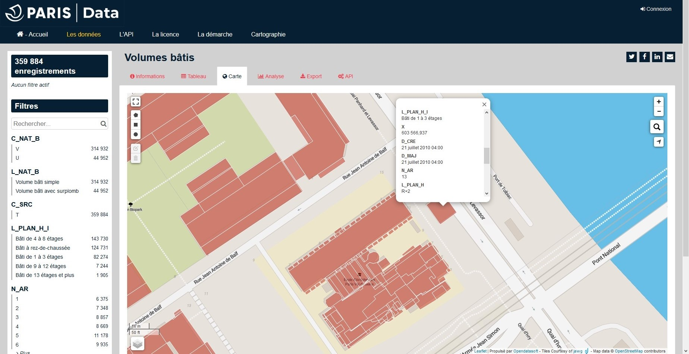
```

\newpage

### Variables et typologies des valeurs

Le premier constat que l'on peut réaliser après avoir brièvement interagi avec la carte est que le jeu de donnée associe un ensemble de **variables** 
(dont la dénomination est commune à l'ensemble de ce jeu) et leurs **valeurs** (possédant elles aussi une notation spécifique) avec une **forme géométrique géolocalisée** 
sur un fond de carte (en l'occurrence, ce sont des **polygones**, formes géométriques les plus à même de représenter l'emprise en plan des différents bâtiments).
\
\
Afin de permettre une lecture plus complémentaire, il paraît intéressant de consulter le tableau fin d'avoir une vue plus "centrée" sur les différentes variables et leurs valeurs.
\

```{r echo=FALSE}
l = "Prévisualisation  du jeu de données des volumes bâtis sous forme de tableau."
s = "https://opendata.paris.fr/"
udfig(l=l,s=s)
```
```{r odp_tbl, echo=FALSE, fig.align = 'center', out.width = "100%"}
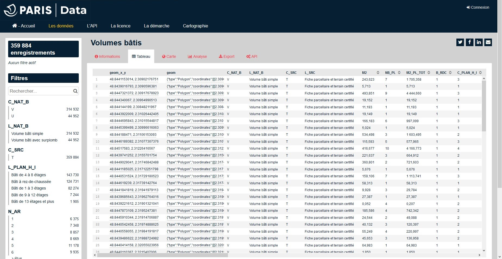
```
\
Chacune d'entre elles est ici représentée par une **colonne**, chaque ligne correspondant à un **volume bâti**.
Tout d'abord, la variable *geom* est celle qui contient les informations géométriques, nous renseignant sur le type de géométrie employée,
ainsi que les coordonnées des points qui la définissent. En l'occurrence, la typologie géométrique "Polygon" se base sur les types primitifs de références des systèmes d'informations géographiques (SIG),
et ses coordonnées sont définies en **latitude/longitude** (ce que confirme la variable *geom_x_y*). 
\


```{r echo=FALSE}
l = "Primitives géométriques des données géoréférencées"
s = "\\url{https://github.com/ClementDelgrange/Cours_programmation_SIG/}"
udfig(l=l,s=s)
```
```{r prim_geom, echo=FALSE, fig.align = 'center', out.width = "100%"}
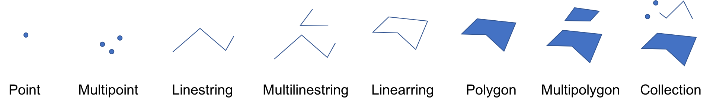
```
\
Nous pouvons également noter que certaines variables comme *L_NAT_B* ou *L_SRC* sont exprimées sous forme de texte, qualifié alors de **"chaîne de caractères"** ("string" ou "str" en anglais) d'un point de vue
informatique. Elles semblent également **catégoriques**, c'est-à-dire ne pouvant prendre qu'un nombre défini de valeurs possibles.
Bien que les noms de ces variables ne soient pas explicites, leurs valeurs permettent d'avoir une première idée de ce qu'elles renseignent.
\
\
À l'inverse, d'autres variables comme *B_RDC* ne possèdent ni un nom explicite ni une valeur permettant de suggérer sa signification, étant catégorique, mais notée
sous forme d'**entiers**.
\
\
Enfin, d'autres variables comme *M2* ou *NB_PL* sont notées **numériquement**, pouvant à priori prendre une infinité de valeurs
, respectivement sous la forme de **réels** (ou nombres à virgule, qualifiés de *float* en anglais), et d'**entiers** (*int*). Bien que l'on puisse 
deviner que *M2* semble représenter la surface d'un volume bâti, cela reste une supposition.
\
\
Rappelons également que toutes ces observations sont faites sur un échantillon visible d'un jeu de données massif. Certaines subtilités présentes 
plus loin dans le tableau peuvent encore échapper à cette lecture préliminaire. 
\
\
Dès lors, chaque variable possédant sa **propre nomenclature**, et étant plus ou moins explicite dans sa dénomination, une première
difficulté de lecture émerge. Heureusement, les jeux de données en Open Data disposent généralement d'informations complémentaires 
capables de renseigner l'utilisateur sur ces nomenclatures.
\

\newpage

### Les métadonnées : clé de compréhension des données

Comme c'est le cas ici, la majorité des jeux de données accessibles en Open Data disposent d'un document annexe de référence, dont le but est à minima de fournir
à l'utilisateur qui souhaite se saisir des données contenues les explications nécessaires à la compréhension des variables constituant
le jeu de données en question. Ce sont **les métadonnées**.
\
\
Elles peuvent également contenir des informations complémentaires concernant le fournisseur, la manière dont les données ont été acquises 
ou encore d'éventuelles limites de précision et recommandations d'utilisation par exemple.
\

```{r echo=FALSE}
l = "Page descriptive issue des métadonnées"
s = "https://opendata.paris.fr/"
udfig(l=l,s=s)
```
```{r odp_meta_1, echo=FALSE, fig.align = 'center', out.height = "49%"}
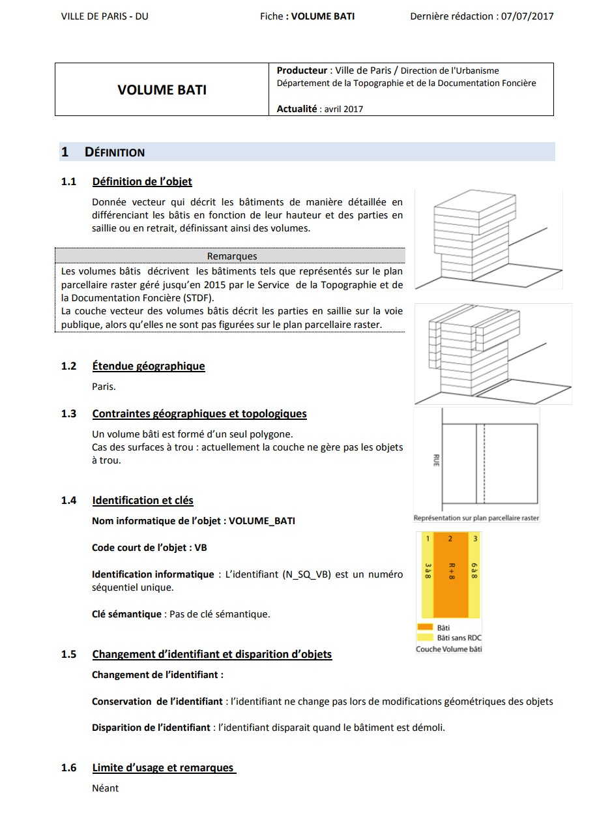
```
\
En l'occurrence, la première page nous renseigne de manière plus exhaustive sur la manière dont ont été tracés les différents polygones,
à travers quelques schémas, ainsi qu'un paragraphe exprimant la source de ces tracés.
Premièrement, ce document explique sa logique de séparer un bâtiment "réel" en plusieurs volumes fictifs, suivant s'ils sont 
en porte à faux ou non, permettant d'apporter une certaine précision.
\
\
Dès lors, les deux informations primordiales associées à chaque polygone sont sa **hauteur**, ainsi que ses différents **intervalles de hauteur** s'il est en porte à faux.
Cette fiche indique également le contexte géographique, ainsi que les limitations géométriques (empêchant ici de représenter un polygone "évidé",
obligeant à le sectionner si l'on veut représenter de manière correcte un patio par exemple). 
\

```{r echo=FALSE}
l = "Table descriptive des variables issue des métadonnées"
s = "https://opendata.paris.fr/"
udfig(l=l,s=s)
```
```{r odp_meta_2, echo=FALSE, fig.align = 'center', out.height = "49%"}
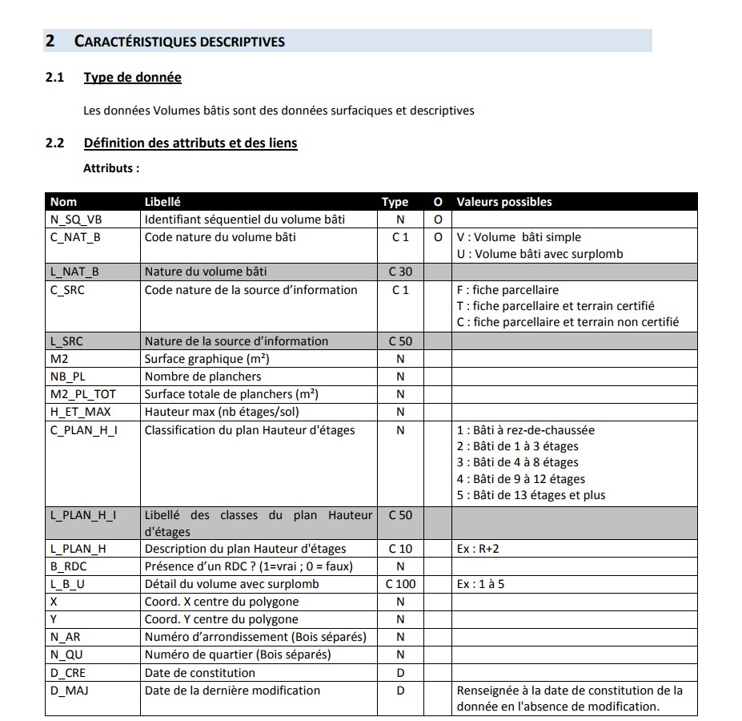
```
\
Enfin, la seconde page contient les informations cruciales concernant les données à exploiter.
\
En effet, le tableau ci-dessus renseigne sur le **libellé** de chaque variable (son contenu explicite), son **type** (ici, **C*n*** où *n* est un entier
signifie que les valeurs sont sous forme textuelle de *n* caractères de long, tandis que **N** désigne simplement des valeurs numériques), ainsi que
ses valeurs possibles si ces dernières sont prédéfinies (servant à distinguer les variables **catégoriques**).
\
Dès lors, il est possible de repérer les deux variables les plus pertinentes si l'on souhaite extraire la hauteur des différents volumes.
En l'occurrence, ce seront les variables **H_ET_MAX** ainsi que **L_B_U** (pour les volumes en porte à faux), toutes deux exprimées en nombre d'étages.
La surface de plancher total **M2_PL_TOT** est également intéressante à extraire.
\
\
Ainsi, les métadonnées offrent les clés de compréhension nécessaires à l'utilisateur afin de comprendre le contenu d'un jeu de données en profondeur.
Cette prise de connaissance permet désormais de manipuler les données en elles-mêmes, au sein d'un script en Python.

\newpage

## Le langage Python pour s'approprier aisément les données ouvertes

Afin d'exploiter ce jeu de données constitué d'objets géolocalisés et leurs données, le langage de programmation **Python** sera exclusivement employé.
Comme mentionné dans l'introduction, ce dernier possède toutes les fonctionnalités nécessaires pour manipuler simplement ce type de données.
\
\
La plateforme Open Data Paris permettant de définir un périmètre afin de restreindre le jeu de données directement sur la carte, 
cette fonction sera utilisée afin d'en télécharger un échantillon (en l'occurrence localisé autour de l'ENSAPVS).
\

```{r echo=FALSE}
l = "Définition d'une zone d'extraction de données des volumes bâtis"
s = "https://opendata.paris.fr/"
udfig(l=l,s=s)
```
```{r odp_carte_zone, echo=FALSE, fig.align = 'center', out.width = "100%"}
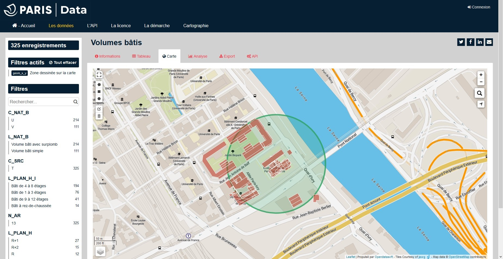
```

```{r echo=FALSE}
l = "Un choix étendu de formats de fichiers"
s = "https://opendata.paris.fr/"
udfig(l=l,s=s)
```
```{r odp_formats, echo=FALSE, fig.align = 'center', out.width = "100%"}
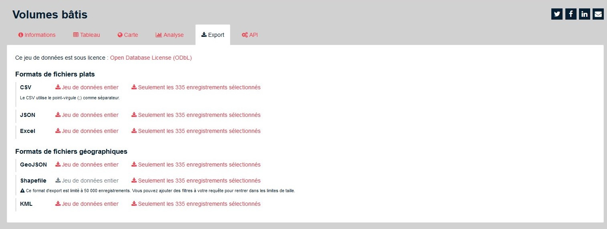
```

À l'instar d'autres jeux de données, celui des "volumes bâtis" propose **plusieurs formats** lors du
téléchargement.
\
\
Dès lors, grâce à son large éventail de **bibliothèques** (comparables à des "extensions") le langage Python se révèle ici précieux
car il est **capable de manipuler tous les formats de fichiers proposés**.
Or, le choix d'un format en particulier pourrait alors être perçu comme un "non-problème", étant donné de telles capacités.
Ainsi, une **brève entrevue** sera apportée sur chacun de ces formats grâce à Python, afin de déterminer lequel choisir.
\

\newpage

### Les formats tabulaires

```{r echo=FALSE}
l = "Chargement du jeu de données sous un format tabulaire dans Python"
s = "réalisation personnelle"
udfig(l=l,s=s)
```
```{r io_csv, echo=FALSE, fig.align = 'center', out.width = "100%"}
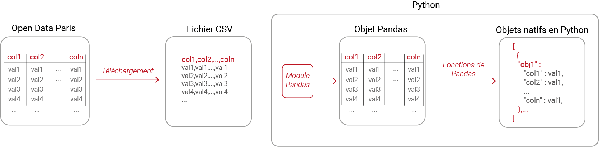
```
```{r echo=FALSE}
l = "Format CSV"
udfig(l=l)
```
```{python}
# Import de la bibliothèque pandas
import pandas
# Lecture du fichier CSV
data = pandas.read_csv("DONNEES/volumesbatisparis.csv",sep=";")
# Affichage du premier élément de la colonne geom
geom = data["geom"][0]
print(type(geom))
```
Tout d'abord, les formats conventionnels de type tableur comme **CSV** ou **Excel** représentent des choix inadaptés.
En effet, dû au fait que le tableur est limité à **un type de valeur par colonne**, en l'occurrence **soit du texte, soit des chiffres**,
des variables telles que **GEOM**, d'une structure plus complexe, s'intègrent ici très mal.
Cela peut être prouvé grâce à la bibliothèque **Pandas**, spécialisée dans la manipulation de formats tableurs, en recréant dans Python
un objet nommé *DataFrame*, composé de lignes et de colonnes.
En l'occurrence, la variable **GEOM** a perdu sa structure, étant notée telle quelle sous forme de **texte** (*str*).

\newpage

### Les formats hiérarchisés

```{r echo=FALSE}
l = "Chargement du jeu de données sous un format hiérarchisé dans Python"
s = "réalisation personnelle"
udfig(l=l,s=s)
```
```{r io_json, echo=FALSE, fig.align = 'center', out.width = "100%"}
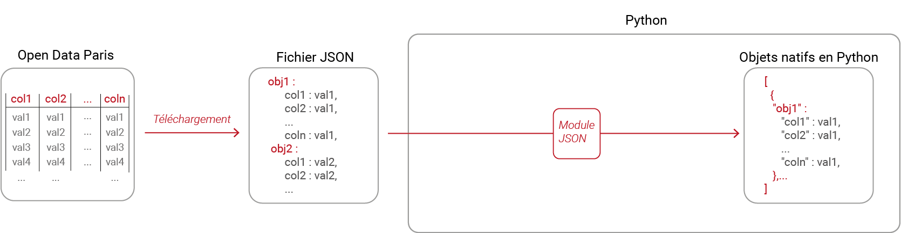
```

```{r echo=FALSE}
l = "Format JSON"
udfig(l=l)
```
```{python}
# Import de la bibliothèque json
import json
# Lecture du fichier JSON
data = json.load(open("DONNEES/volumesbatisparis.json","r"))
# Objet au hasard dans la liste
print(data[22]["fields"]["geom"]["coordinates"])
```

Ensuite, le format **JSON** semble adapté à la structure de la variable **GEOM**, permettant ici d'en extraire les sous-informations.
Cependant, il est nécessaire au préalable de **lire le fichier en lui-même** via un éditeur de texte, afin d'en repérer la hiérarchie.
Cette dernière se repose sur la **notation objet**, une syntaxe commune à de nombreux langages de programmation modernes comme le Python.
Elle est constituée d'ensembles (listes) de couples **attribut : valeur**, que l'on peut **hiérarchiser** en les imbriquant.
\
\
```{r echo=FALSE}
l = "Structure d'un volume et de ses données au format JSON"
udfig(l=l)
```
```{python}
expl = {
  "datasetid": "volumesbatisparis",
  "recordid": "9cb9b7143c595f9cd2b88e4d5bc588112fedc5a8",
  "fields": {
    "objectid": 536158,
    "n_sq_pf": 750031416,
    "d_maj": "2010-07-21T04:00:00+02:00",
    "l_src": "Fiche parcellaire et terrain certifié",
    "l_b_u": "Ra1_et_encorbt_au_3",
    "h_et_max": 3.0,
    "b_rdc": 1.0,
    "n_ar": 13,
    "m2_pl_tot": 12.7752023,
    "d_cre": "2010-07-21T04:00:00+02:00",
    "m2": 4.2584008,
    "l_plan_h_i": "Bâti de 1 à 3 étages",
    "n_sq_qu": 750000050,
    "geom_x_y": [
        48.8272714473,
        2.38477660061
    ],
    "l_nat_b": "Volume bâti avec surplomb",
    "n_qu": 50.0,
    "c_plan_h_i": 2.0,
    "shape_area": 0.0,
    "c_src": "T",
    "nb_pl": 3.0,
    "n_sq_vb": 750170119,
    "shape_len": 0.0,
    "c_nat_b": "U",
    "geom": {
      "type": "Polygon",
      "coordinates": [[
                        [2.384770481308271,48.827286816032526],
                        [2.384796971933453,48.82726286263405],
                        [2.384782602464847,48.8272560560162],
                        [2.384756236578184,48.82728017373901],
                        [2.384770481308271,48.827286816032526]
                    ]]
            },
            "n_sq_ar": 750000013,
            "y": 125199.7506478,
            "x": 603542.699385
  }}
```
\
\
Dès lors, une fois cette notation assimilée, ce format permet une lecture relativement **aisée** pour l'utilisateur, tout en restant **simple** à lire par la machine. 
Le code d'extraction découle donc naturellement de la lecture humaine.

\newpage

### Les formats géographiques

Enfin, puisque le jeu de données en question est constitué **d'objets géoréférencés**, les formats **GeoJSON**,
**Shapefile** et **KML** semblent être les formats les plus adaptés.
Or, chacun de ces formats possède **sa propre notation normée pour les données géographiques**, ce qui nécessite habituellement
l'utilisation d'outils spécifiques comme **QGIS** afin de les lire.  
\
\
Cependant, le langage Python possède une bibliothèque nommée **GeoPandas** spécialisée dans la **manipulation de données géoréférencées**.
De manière similaire à la bibliothèque **Pandas** montrée plus haut, elle permet de traduire une collection d'**objets géoréférencés**
en un objet *DataFrame* similaire à un tableur, cette fois-ci sans limitations au niveau des types de données.
En outre, cette représentation prodigue un grand nombre de **fonctions** applicables aux
lignes et aux colonnes permettant par la suite d'opérer des transformations de manière aisée.

```{r echo=FALSE}
l = "Chargement du jeu de données sous un format géographique dans Python"
s = "réalisation personnelle"
udfig(l=l,s=s)
```
```{r io_gpd, echo=FALSE, fig.align = 'center', out.width = "100%"}
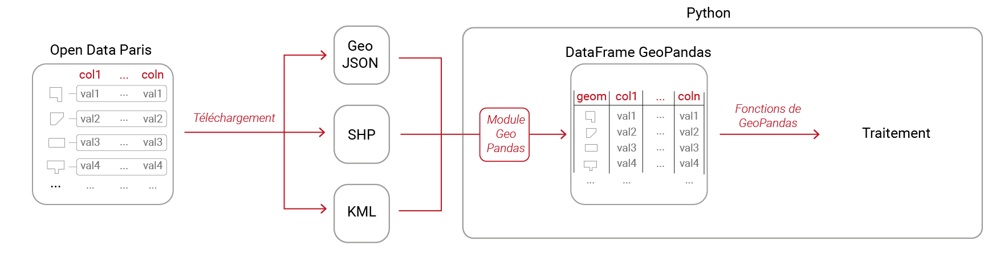
```

```{r echo=FALSE}
l = "Formats KML\\, GeoJSON et ShapeFile"
udfig(l=l)
```
```{python}
# Import de géopandas sous l'acronyme gpd
import geopandas as gpd
# Spécification nécessaire à la lecture du KML
gpd.io.file.fiona.drvsupport.supported_drivers['KML'] = 'rw'
# Lecture de la variable "geom" dans les différents fichiers
data = gpd.read_file("DONNEES/volumesbatisparis.kml", driver='KML')
print(data[["geometry"]])
data = gpd.read_file("DONNEES/volumesbatisparis.shp")
print(data[["geometry"]])
data = gpd.read_file("DONNEES/volumesbatisparis.geojson")
print(data[["geometry"]])
```

De plus, **les objets géoréférencés** sont automatiquement convertis en formes géométriques,
permettant d'y appliquer des manipulations géométriques spécifiques.

```{r echo=FALSE}
l = "Une aisance des opérations géométriques"
udfig(l=l)
```
```{python}
# Calcul du centroïde pour le premier objet en une seule ligne
print(data["geometry"][0].centroid)
```

Pour toutes ses qualités, cette approche avec **GeoPandas** sera privilégiée à travers les chapitres suivants.
Enfin, quant au format de fichier en lui-même, le **GeoJSON** sera ici arbitrairement choisi.
\
\
Ainsi, grâce à une **immense compatibilité** avec la majorité des types de formats courants en Open Data (prodiguée par ses nombreuses bibliothèques), 
le langage Python constitue d'ores et déjà un formidable outil d'extraction, permettant de **s'approprier facilement** des jeux de données à la **structure complexe**.
Cependant, son véritable intérêt réside dans son statut de langage de programmation, étant alors capable de traitements automatiques avancés.

\newpage

## Aperçu de la souplesse des fonctions de manipulation de données

Après la phase d'extraction précédente, il est nécessaire que les données extraites en l'état soient exploitables pour la suite.

Premièrement, le jeu de données sera réduit aux variables identifiées lors de la lecture des métadonnées (à savoir **GEOM**,**M2_PL_TOT**,**H_ET_MAX** ainsi que **L_B_U**),
et ces dernières seront renommées afin d'être plus facilement lisibles par la suite.

```{r echo=FALSE}
l = "Apurement et renommage du jeu de données"
udfig(l=l)
```
```{python}
data = data[["geometry","m2_pl_tot","h_et_max","l_b_u"]]
data = data.rename(columns={
    "m2_pl_tot" : "surface",
    "h_et_max" : "hauteur",
    "l_b_u" : "hauteur_paf"
    })
print(data)
```

Dès lors, il serait souhaitable d'exprimer les hauteurs en **mètres** plutôt qu'en nombre de niveaux.

```{r echo=FALSE}
l = "Transformation du nombre de niveaux en mètres"
udfig(l=l)
```
```{python}
h_etage = 3
print(data["hauteur"][0] * h_etage)
```
Cette opération est triviale pour l'attribut **hauteur**, étant exprimée numériquement. Il suffit alors de définir une **hauteur d'étage type** et
d'effectuer une multiplication.
\
Cependant, l'attribut **hauteur_paf** étant exprimé sous la forme de **texte** (chaînes de caractères) décrivant les plages de hauteur,
il est nécessaire de convertir cette notation numériquement afin d'effectuer cette multiplication.

\newpage

### Approche compréhensive des différentes notations grâce à Python

Heureusement, Python est capable de reconnaître des morceaux de texte au sein de chaînes de caractères, permettant ainsi de les remplacer par leur équivalent numérique.

```{r echo=FALSE}
l = "Exemple de détection de texte en Python"
udfig(l=l)
```
```{python}
if "da" in "data":
  print(1)
else:
  print(0)
```

Dès lors, afin de comprendre les différentes manières d'exprimer les hauteurs en porte à faux, il est possible de les énumérer par la **longueur de leur texte** de chacune des notations.
\
\
Pour ce faire, un **dictionnaire** vide sera préalablement créé. C'est le type de donnée utilisé en Python afin de représenter la notation objet, en associant
un **attribut** (sous forme de texte ou d'entiers) avec une **valeur** (pouvant être de type varié).

```{r echo=FALSE}
l = "Fondamentaux du dictionnaire en Python"
udfig(l=l)
```
```{python}
# Dictionnaire à deux objets
d = {"A" : 10, "B" : 15}
# Récupération de la valeur associée à "A"
print(d["A"])

# Changement de la valeur associée à "B"
d["B"] = 30
print(d["B"])
```

Une **boucle** avec **for** servira ensuite à itérer à travers les différentes notations de la variable **l_b_u**.

```{r echo=FALSE}
l = "Exemple de boucle en for"
udfig(l=l)
```
```{python}
# Liste de valeurs
l = [0,1,2,"trois"]

for item in l:
  print(item)
```
Comme le montre le code ci-dessous, pour chaque objet (**for** *objet*)  contenu dans la liste l (*in* *l*), la boucle affecte un nom de variable défini (ici, **item**),
permettant d'opérer sur chaque objet individuellement. 
\
\

Ainsi, en itérant à travers chaque notation contenue dans la colonne **hauteur_paf**, un **exemple de notation** sera affecté au dictionnaire vide créé précédemment en prenant
comme attribut sa **longueur**. En réalité, pour chaque longueur, c'est la dernière notation qui sera conservée, chacune d'elle écrasant la précédente.
Enfin, la fonction *dropna()* est employée ici pour supprimer les valeurs nulles pour les volumes non concernés.


```{r echo=FALSE}
l = "Énumération des différentes notations"
udfig(l=l)
```
```{python}
# Création d'un dictionnaire vide
notations = {}
# Itération à travers la colonne "l_b_u"
for txt in data["hauteur_paf"].dropna():
  notations[len(txt)] = txt
print(notations)
```

Dès lors, certains éléments constituants peuvent être notés :

* Une plage de hauteur est principalement renseignée par ses **deux niveaux de hauteur** séparés par un *a*
* *_et_* est utilisée pour renseigner **plusieurs plages de hauteur**.
* *"encorbt_au_N"* désigne une plage de hauteur du niveau **N** au niveau maximal (exprimé par la variable "hauteur").
S'ils désignent le même niveau, la plage sera du niveau **N^-1^** au niveau maximal.
* *auvent* désigne une plage du niveau **N** à **N^+1^**. 
* Enfin, la présence de *R* exprimé seul suggère que **R** désigne une plage d'une **seule hauteur d'étage partant du sol**, tandis que
 **Ra1** désigne **deux hauteurs d'étages partant du sol**.

```{r echo=FALSE}
l = "Aperçu des différentes notations caractérisant les porte à faux"
s = "Réalisation personnelle"
udfig(l=l,s=s)
```
```{r hpaf, echo=FALSE, fig.align = 'center', out.width = "100%"}
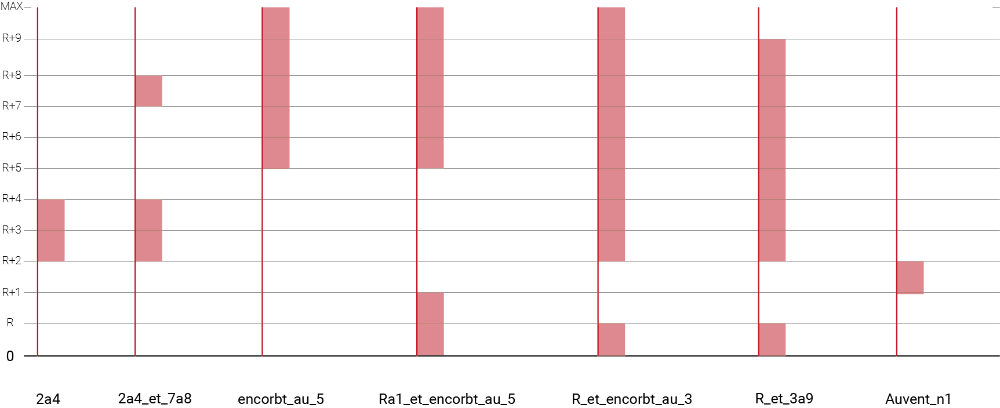
```

Cette dernière observation est cruciale : si l'on fixe **R = 0**, alors la plage **Ra1** devient **0a1**. Or, si l'on multiplie ces deux bornes
par la hauteur d'étage type de 3 mètres, le volume aura une plage de hauteur de **0 à 3m**, tandis qu'il faudrait obtenir **0 à 6m**.
Dès lors, il faut **ajouter 1 à tout nombre de niveaux sauf R** avant multiplication par la hauteur d'étage type.

\newpage

### De la chaîne de caractère à la valeur numérique

À la lumière de toutes ces subtilités, il est désormais possible de créer une fonction capable de **transformer des chaînes de caractères** en **valeurs numériques**.
Le code ci-dessous illustre la transformation d'une notation **N^1^aN^2^**. Après s'être assuré que la notation contient
bien un *a*, le code sépare les deux bornes à cet endroit, puis les convertit en **entiers**.
Enfin, chaque borne est incrémentée de **1** avant multiplication par la hauteur d'étage type, sauf *R* qui prend la valeur 0. 

```{r echo=FALSE}
l = "Énumération des différentes notations"
udfig(l=l)
```
```{python}
# Rappel : h_etage = 3 mètres
h_paf =  "Ra8"
if "a" in h_paf:
  # Séparation des deux chiffres au niveau du "a"
  hauteur = h_paf.split("a")
  # Conversion de chaque chiffre en entier, puis multiplication par la hauteur d'étage type
  # Si "R" est présent, il prend la valeur 0
  hauteur = [(int(h)+1)*h_etage if h != "R" else 0 for h in hauteur]

print(hauteur)
```

Suivant ce principe, la **fonction** suivante opèrera ce type de transformation suivant les différentes notations relevées
précédemment sur l'ensemble des volumes.
Une **fonction** est un bloc de code que l'on définit **une seule fois** dans un script avec un **nom** et éventuellement des
**arguments** (paramètres), et que l'on peut exécuter autant de fois que l'on souhaite par la suite en l'appelant par son nom.
Ici, cette fonction sera appelée **texte_to_num**, et prendra pour argument chaque volume, afin de convertir la notation caractérisant son porte à faux en expression numérique.
Elle appliquera également la transformation de la variable **hauteur** (à savoir un incrément de 1 suivi d'une multiplication par la hauteur d'étage type).

```{r echo=FALSE}
l = "Fonction à appliquer à l'ensemble des volumes"
udfig(l=l)
```
```{python}
# Rappel : h_etage = 3 mètres
def texte_to_num(volume):
     # Si le volume n'est pas en porte à faux
    if volume["hauteur_paf"] == None:
        # Affecter une valeur nulle
        volume["hauteur_paf"] = None
    else:
        # Liste vide pour contenir les notations numériques
        output = []
        # Séparation des sous-notations au niveau du "_et_"
        # Si absent, la notation sera conservée telle quelle
        intervalles = volume["hauteur_paf"].split("_et_")
        # Itération à travers les sous-notations
        for interv in intervalles:
            # filtrage par syntaxe
            if "encorbt_au_" in interv:
                n = int(interv.strip("encorbt_au_"))
                if n == volume["hauteur"]:
                    output.append([n*h_etage,(n+1)*h_etage])
                else:
                    output.append([(n+1)*h_etage,(volume["hauteur"]+1)*h_etage])
            elif "auvent_n" in interv:
                n = int(interv.strip("auvent_n"))
                output.append([n*h_etage,(n+1)*h_etage])
            elif "a" in interv:
                if "R" in interv:
                    output.append([0,(int(interv.strip("Ra"))+1)*h_etage])
                else:
                    output.append([(int(h)+1)*h_etage for h in interv.split("a")])
            elif interv == "R":
                output.append([0,h_etage])
            # Remplacement par la notation numérique
            volume["hauteur_paf"] = output

    volume["hauteur"] = (volume["hauteur"] + 1)*h_etage
    return volume
```

Enfin, cette fonction peut-être appliquée automatiquement à l'ensemble du jeu.

```{r echo=FALSE}
l = "Application de la fonction sur le jeu de données"
udfig(l=l)
```
```{python}
# Application à chaque volume avec .apply()
data = data.apply(texte_to_num,axis=1)
# Affichage des 3 premiers volumes
print(data.head(3))
```

Comme démontré au cours de ce chapitre, le langage de programmation Python 
possède une souplesse lui permettant d'extraire et de manipuler facilement les formats de données courants en Open Data,
et de palier aux éventuelles difficultés posées par la structure ou encore le formatage des jeux de données, le tout bénéficiant
d'une syntaxe claire tout au long du code.
**Ainsi, à la fois outil de compréhension et de traitement, il se révèle extrêmement précieux lorsque l'on souhaite 
exploiter des jeux de données en Open Data.**
\
\
Dans le contexte de la profession architecturale, l’obtention de ces données n’a cependant que peu de valeur si l’architecte 
ne peut l’intégrer dans son environnement de travail, ce à quoi le prochain chapitre est dédié.

\newpage

# Intégrer des données ouvertes au sein du "workflow" de l’architecte

La production de documents synthétiques, en particulier les éléments graphiques 
faisant partie intégrante du « workflow » de l’architecte, 
il est primordial de s’y intéresser au sein de ce mémoire.
\
\
En effet, c’est via ce type de document que l’architecte est capable de 
non seulement communiquer sa production ou encore sa démarche de conception, 
mais également de se documenter au cours de sa démarche.
\
\
Or, il s'avère que le langage Python regorge de bibliothèques spécialisées dans la visualisation de données telle que
*Matplotlib* [@matplotlib] ou encore *Seaborn*[@seaborn], dont la plateforme *The Python Graph Gallery* contient de nombreux exemples[@pythondataviz],
offrant énormément de possibilités de représentation, du graphique statistique au modèle 3D.
\
\
**Ce chapitre présentera ainsi plusieurs variantes d’exploitation du script 
obtenu à la fin du chapitre précédent dans le but d’obtenir des documents 
synthétiques à partir des données des bâtiments obtenues. 
Elles seront respectivement consacrées à l’élaboration de graphiques statistiques, 
puis d’une carte interactive, d’un dessin vectorisé avec gestion des calques, puis aboutir à un modèle 3D du contexte bâti.**


```{r echo=FALSE}
l = "Moyens d'export et de synthèse des données récoltées"
s = "Réalisation personnelle"
udfig(l=l,s=s)
```
```{r p2_sommaire, echo=FALSE, fig.align = 'center', out.height = "90%"}
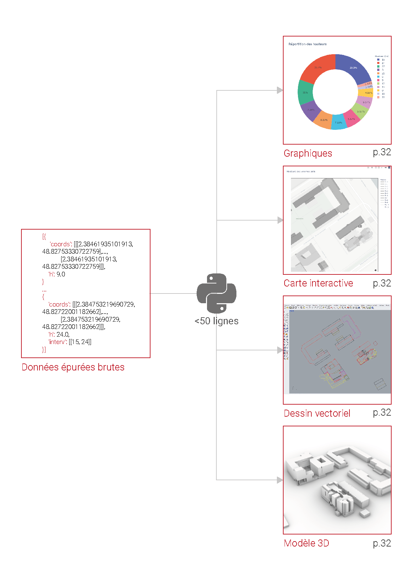
```

\newpage

## Production de documents synthétiques interactifs

Cette section présentera deux méthodes afin de visualiser les données extraites.
Au sein de cette section, la bibliothèque *Plotly* sera employée, possédant davantage d'options graphiques ainsi que de possibilités d'export (dont des options d'interactivité) 
que son concurrent plus répandu *Matplotlib* mentionné précédemment. 

\newpage

### Visualisation statistique des données

Lorsque l’on aborde la question de la synthèse de données quelles qu’elles soient, la représentation statistique par des graphiques semble représenter l’approche la plus intuitive et la plus directe.
Le premier graphique créé sera un histogramme de **répartition du nombre de volumes par hauteur**.

```{r echo=FALSE}
l = "Import de plotly et obtention du nombre de volumes par hauteur"
udfig(l=l)
```
```{python}
import plotly.graph_objects as go
n_par_hauteur = data["hauteur"].value_counts().to_dict()
print(n_par_hauteur)
```
Le code ci-dessus permet d'importer la bibliothèque *Plotly* (par l’intermédiaire d’un de ses sous-modules nommé « graph_objects », que nous appellerons ici avec « go » tout au long du script).
Après cet import, la fonction *value_counts()* de *GeoPandas* permet ici de récupérer le **nombre de volumes par hauteur** automatiquement (en énumérant chaque valeur possible et le nombre d'occurrences dans la colonne), 
puis ajoute le tout dans un dictionnaire nommé **n_par_hauteur**.
\
\
Enfin, quelques lignes de codes permettent à la fois la construction du graphique, ainsi que son export.
La **liste des différentes hauteurs** (soit celle des *attributs* du dictionnaire **n_par_hauteur**) représentera l'axe *x*,
tandis que les différents **nombres de volumes** associés formeront les valeurs à renseigner pour l'axe *y*.
Quelques paramètres graphiques servent à définir un titre général, des libellés pour les deux axes ainsi qu'une résolution d'export.
Ici, deux exports possibles seront montrés, à savoir un export **statique** sous forme d'image au format PNG, ainsi qu'un export **interactif** au sein d'une page web au format HTML. 

```{r echo=FALSE}
l = "Génération du graphique et export"
udfig(l=l)
```
```{python results='hide'}
fig = go.Figure([go.Bar(x=list(n_par_hauteur.keys()), y=list(n_par_hauteur.values()),opacity=0.8,marker_color='rgb(200,0,0)')])
fig.update_xaxes(categoryorder='category ascending',tickvals=sorted(list(n_par_hauteur.keys())))
fig.update_layout(title="Répartition des hauteurs",xaxis_title="hauteur (m)",yaxis_title="nombre de volumes",width=600,height=600)
fig.write_image("OUTPUT/graphique_hauteurs.png")
fig.write_html("OUTPUT/graphique_hauteurs.html")
```

```{r echo=FALSE}
l = "Nombre de volumes par hauteur"
s = "Réalisation personnelle"
udfig(l=l,s=s)
```
```{r graph_h, echo=FALSE, fig.align = 'center', out.width = "45%",fig.show='hold'}
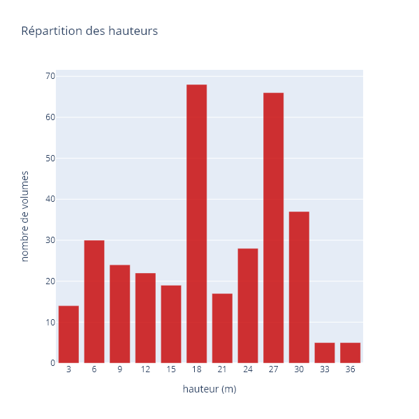
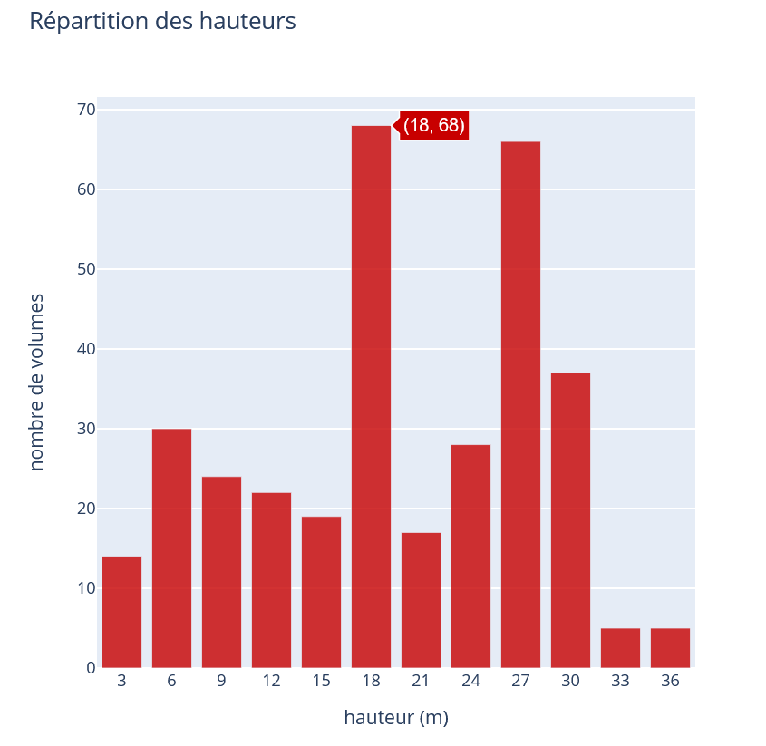
```

Il est également possible de créer de la même manière une multitude d'autres graphiques que *Plotly* permet de construire.
Un second graphique plus complet peut être construit, en s'intéressant cette fois-ci à une répartition **des volumes suivant leur hauteur, leur surface et s'ils sont en porte à faux**.
Ici, le sous-module *express* de *Plotly* sera employé permettant une mise en forme plus condensée.
L'objectif est donc ici de se baser directement sur le jeu de données des volumes. 
Cependant, une nouvelle colonne devra être ajoutée, spécifiant si chaque volume est en porte à faux ou pas,
afin de pouvoir ajouter cette valeur dans *Plotly*.

```{r echo=FALSE}
l = "Création d'un second graphique de répartition des volumes"
udfig(l=l)
```
```{python results='hide'}
import plotly.express as px
# Fonction permettant de déterminer
# si un volume est en porte à faux
def is_paf(volume):
    if volume["hauteur_paf"] == None:
        return 0
    else:
        return 1

# Suppression de la colonne "geometry"
df = data.drop("geometry",axis=1)
# Création de la nouvelle colonne grâce à .apply()
df["is_paf"] = df.apply(is_paf, axis=1)
# Génération du graphique et export
fig2 = px.parallel_coordinates(df, color="hauteur",color_continuous_scale=px.colors.sequential.amp)
fig2.update_layout(font={"size":20},width=1800,height=800)
fig2.write_image("OUTPUT/graphique_repart.png")
fig2.write_html("OUTPUT/graphique_repart.html")
```

```{r echo=FALSE}
l = "Répartition des volumes selon leurs caractéristiques"
s = "Réalisation personnelle"
udfig(l=l,s=s)
```
```{r graph_repart, echo=FALSE, fig.align = 'center', out.width = "100%",fig.show='hold'}
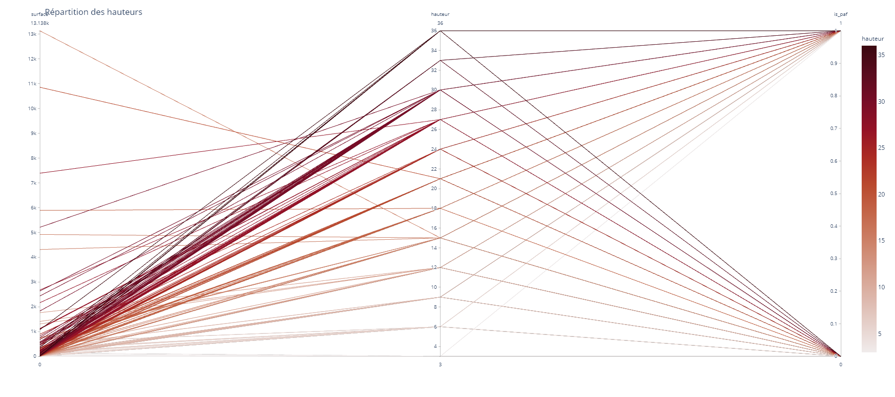
```

En l'occurrence, le jeu de données extrait contient davantage de petites surfaces ainsi qu'un nombre équilibré de volumes en porte à faux.
Cependant, cette souplesse dans la création de représentations graphiques que permet *Plotly*
rend surtout possible de dessiner les **emprises des volumes en eux-mêmes**, qui sera également augmentée avec de l'interactivité.

\newpage

### Cartographier de manière interactive

Cette sous-section a pour but de présenter une fonctionnalité particulièrement utile pour la profession architecturale.
En effet, *Plotly* est capable de représenter des **formes géométriques géoréférencées sur un fond de carte** 
(sans avoir besoin de convertir les coordonnées en latitude/longitude), avec lequel il est possible d'**interagir**, notamment à travers 
des fonctionnalités telles que le **zoom**, l'**affichage/masquage** d'élements légendés ainsi que l'affichage de caractéristiques au **survol avec le curseur**.
Ainsi, l'objectif sera ici de générer une **carte interactive des volumes par hauteur**.

```{r echo=FALSE}
l = "Import de Plotly et tri des volumes par hauteur"
udfig(l=l)
```
```{python results='hide'}
import plotly.graph_objects as go
# Création de sous-groupes de volumes par hauteur
volumes_par_hauteur = data.groupby("hauteur")
```
Après avoir chargé le jeu de données de base, la première étape est de **grouper les volumes par hauteur**. Ceci sera effectué grâce à la 
fonction *groupby()* de *GeoPandas*.
Le tout sera trié selon la hauteur par **ordre croissant**.


Ensuite, une **boucle** en **for** permet d'itérer à travers chaque groupe de **hauteur et ses volumes** afin de les tracer.
Une **couleur** sera préalablement attribuée pour chacune d'entre elles, calculée selon une échelle de gris en RGB (plus le volume est **haut**, plus il sera **clair**).
La seule subtilité ici est de devoir traiter **les listes de coordonnées latitude/longitude** en **deux listes séparées**, et
ainsi avoir une liste pour les valeurs de **latitude** et une autre pour les valeurs de **longitude**, contenant ponctuellement des valeurs **nulles** pour
séparer les volumes lors du traçage.
\

```{r echo=FALSE}
l = "Génération des couches de la carte"
udfig(l=l)
```
```{python results='hide'}
# Liste accueillant les couches de la carte
traces = []
for h,volumes in volumes_par_hauteur:
  couleur = "rgb(" + ",".join([str(h/max(data["hauteur"])*255)]*3) +")"
  X = []
  Y = []
  for geom in volumes["geometry"]:
    coords = geom.exterior.coords.xy
    X += list(coords[0][:-1])+[None] # longitude
    Y += list(coords[1][:-1])+[None] # latitude
    # Traçage des volumes
  traces.append(go.Scattermapbox(
    name=str(h) +"m",
    mode="lines",
    line = {"width" : 0.5, "color" : couleur},
    lon=X,
    lat=Y,
    opacity=1.0,
    hoverinfo="name",
    fill="toself"))
```
Enfin, la carte complète (avec chaque couche de volumes pour chaque hauteur) est créée à partir de la liste *traces*, 
en configurant le titre, la légende ainsi que le style de fond de carte. Le tout est sauvegardé au format .HTML, 
permettant de l’ouvrir dans un navigateur afin de permettre l’interactivité et la **navigation libre** dans le fond de carte.

```{r echo=FALSE}
l = "Export de la carte"
udfig(l=l)
```
```{python results='hide'}
fig = go.Figure(traces)
fig.update_layout(title="Hauteurs des volumes bâtis",legend_title="Hauteur", autosize=True,
    mapbox = {'style':"carto-positron",'center': {'lon': 2.3848515, 'lat': 48.8272092}, "zoom" : 16.6})
# Export sous forme d'une page web interactive
fig.write_html("OUTPUT/carte_des_hauteurs.html")
```

```{r echo=FALSE}
l = "Carte des volumes par hauteur avec de l'interactivité"
s = "Réalisation personnelle"
udfig(l=l,s=s)
```
```{r carte_inter, echo=FALSE, fig.align = 'center', out.width = "45%",fig.show='hold'}
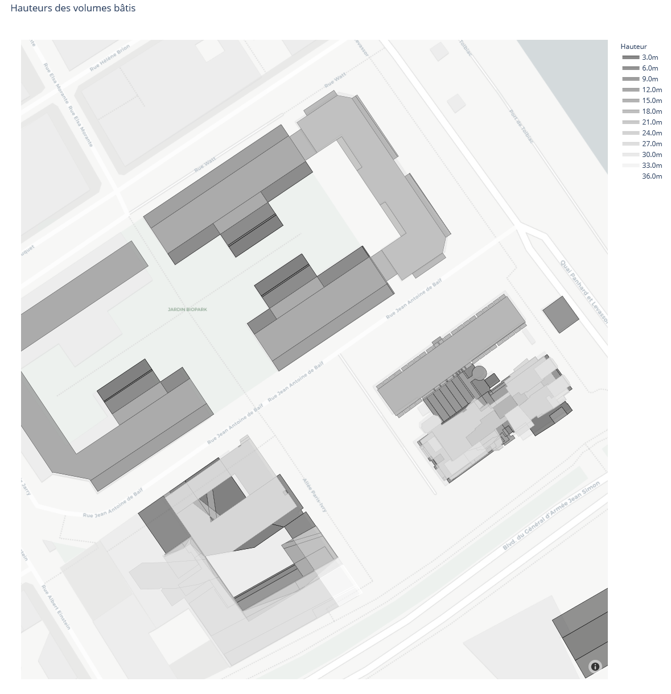
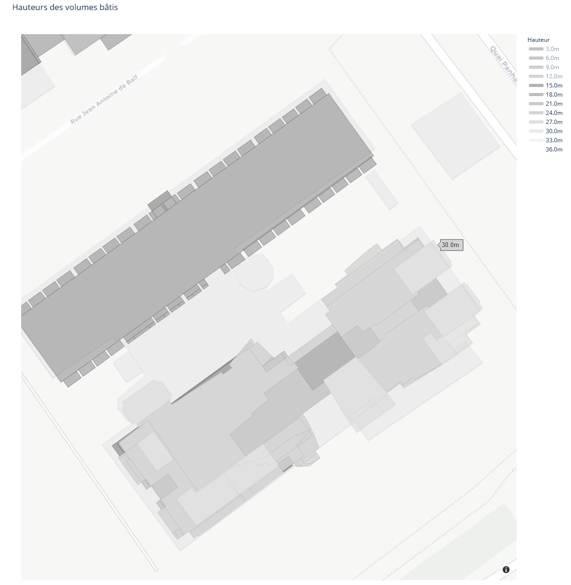
```

Dès lors, une telle capacité à cartographier avec souplesse des données brutes présente un intérêt certain
au sein de la pratique architecturale.

**Ainsi, ces aperçus attestent de la capacité du langage Python à produire facilement de multiples
représentations graphiques synthétiques à partir de données brutes, du graphique statistique 
aux cartes interactives, renforçant ainsi la pertinence de son utilisation dans le cadre de l'exploitation
de données issues de l'Open Data pour les architectes.**

\newpage

## Génération automatique de documents techniques.

Les capacités de synthèse graphique et de cartographie des données montrées précédemment sont certes intéressantes,
mais le domaine de la conception architecturale est surtout concerné par la production de dessins, modèles 3D et 
autres représentations techniques à l'échelle dans le cadre d'un projet. 
Cette section permettra de répondre à cet enjeu grâce à Python.

\newpage

### Fichier CAD vectorisé et hiérarchisé

Le premier aperçu livré dans cette section, sera de **produire un document vectorisé au format .DXF** 
(format d’échange de dessin vectorisé similaire au .DWG, répandu en CAO), où seront tracés les **différents volumes sous forme de polylignes**. 
Chacun d’entre eux sera également classé dans un **calque correspondant à sa hauteur**, avec pour chaque calque une couleur différente.
Pour ce faire, le module **ezdxf** sera employé. Ce dernier permet la plupart des fonctions de dessin vectoriel
que propose d'autres outils de CAD tels qu'*AutoCAD*, dont la création de calques entre autres.
\
\
Cependant, il est ici indispensable de convertir les **coordonnées géodésiques** exprimées en *degrés de latitude/longitude* en **coordonnées cartésiennes** exprimées en unités de grandeur terrestres.
Pour cela, la projection *Lambert93* sera utilisée, car exprimée en **mètres** et étant **orthonormée** (son calcul prenant en compte la rotondité de la Terre).
Elle se révèle donc essentielle pour pouvoir dessiner dans un repère tel qu'un dessin vectorisé.
Heureusement, *GeoPandas* permet cette conversion, en référençant le code du système de coordonnées de référence (CRS) par défaut (ici, le système latitude/longitude *WGS84*),
puis celui de la projection *Lambert93*.


```{r echo=FALSE}
l = "Changement du Système de Coordonnées de Référence"
udfig(l=l)
```
```{python}
# Coordonnées latitude/longitude (WGS84)
data.crs = 4326
# Coordonnées X/Y (Lambert93)
data = data.to_crs(2154)
# Affichage d'un exemple de coordonnées
print(data.head(1))
```

Après l'import du module *ezdxf*, un nouveau dessin est initialisé. 
Ensuite, **un calque par hauteur** sera créé en amont des tracés des volumes, de sorte qu'ils
apparaissent dans un ordre croissant au sein du futur fichier. Tout comme dans la carte interactive présentée dans la session
2.1.2, une **teinte de couleur proportionnelle à chaque hauteur** sera créée (en l'occurrence, sur du rouge).


```{r echo=FALSE}
l = "Initialisation du dessin et création des calques"
udfig(l=l)
```
```{python}
import ezdxf
# initialisation d'un nouveau dessin
doc = ezdxf.new(dxfversion='R2010')
msp = doc.modelspace()
# Récupération et tri des différentes hauteurs
hauteurs = sorted(data["hauteur"].unique())
# Itération à travers les différentes hauteurs
for h in hauteurs:
  # Création d'un nouveau calque nommé
  calque = doc.layers.new(str(h) + "m")
  # Affectation d'une couleur suivant la hauteur
  calque.rgb = (255*(h/hauteurs[-1]),0,0)
```

Ceci effectué, une boucle itèrera à travers chaque volume du jeu de données (grâce à la fonction *iterrows()* de *GeoPandas*).
Pour chacun d'entre eux, une **polyligne** peut être tracée à partir des coordonnées des points pour représenter l'emprise de chaque volume,
puis être affectée au calque correspondant à la hauteur du volume.

```{r echo=FALSE}
l = "Traçage des volumes et affectation dans les calques"
udfig(l=l)
```
```{python  results='hide'}
for row,volume in data.iterrows():
    # Extraction des coordonnées des points du polygone
    coords = list(zip(*volume["geometry"].exterior.coords.xy))
    # Affectation au sein du calque correspondant à sa hauteur
    calque = str(volume["hauteur"]) + "m"
    msp.add_polyline2d(coords, dxfattribs={'layer': calque})

doc.saveas("OUTPUT/plan_bati.dxf")
```

```{r echo=FALSE}
l = "Fichier vectoriel organisé des emprises des volumes"
s = "Réalisation personnelle"
udfig(l=l,s=s)
```
```{r dessin_cad, echo=FALSE, fig.align = 'center', out.width = "100%",fig.show='hold'}
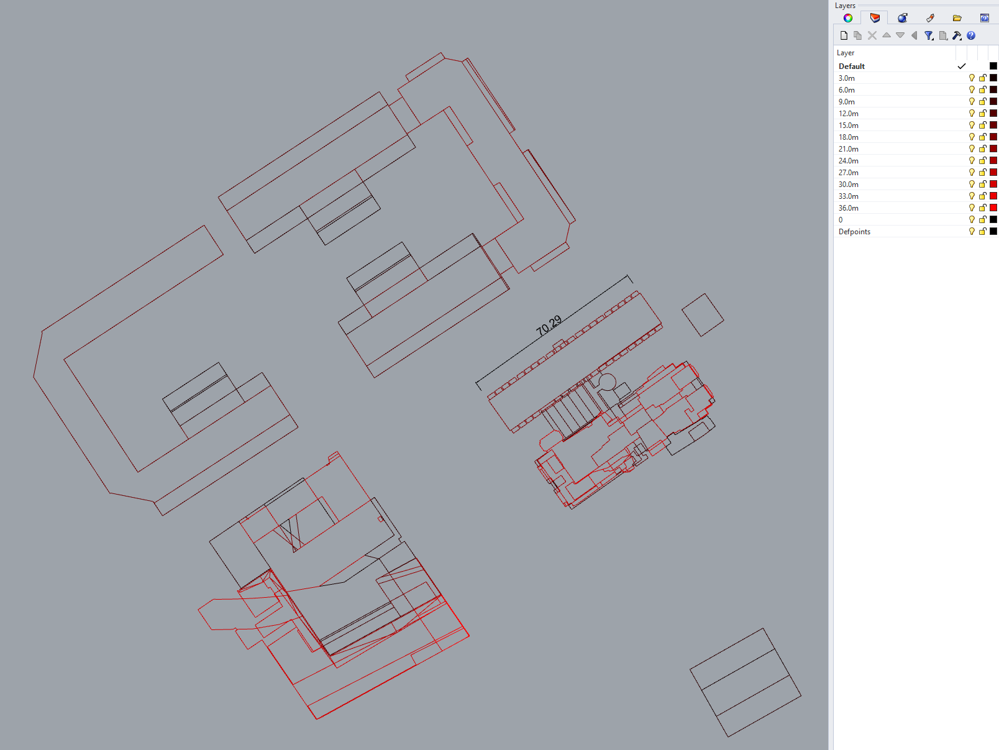
```

Le document fourni en sortie peut ensuite être importé dans n'importe quel logiciel 
supportant le format DXF, ce qui est le cas pour la majorité des outils de dessin vectoriel des agences d'architecture.
Ce document est d'autant plus exploitable qu'il reste **géoréférencé** (les volumes conservent leurs coordonnées *Lambert93* dans le dessin),
et **à l'échelle** (puisque ces coordonnées sont exprimées en mètres).
\
De plus, les options de **personnalisation** des calques permettent de hiérarchiser les données
dont on dispose en amont d'une exploitation "manuelle".

Ainsi, le langage Python prouve également son efficacité lorsqu'il est question de générer des documents
vectoriels graphiques, pleinement exploitables comme support de travail.

\newpage

### Construction d’un modèle 3D

Cette sous-section aura pour but de clore le chapitre en exploitant à son plein potentiel le jeu de donné extrait.
En effet, puisque l'on dispose à la fois d'**emprises géométriques traçables** ainsi que de **hauteurs**, construire un **modèle 3D**
automatiquement se présente comme un aboutissement certain, d'autant plus qu'il représente tout naturellement une
forte utilité pour l'architecte.
\
\
Bien que Python possède des bibliothèques permettant de manipuler de la 3D telle que **PyOpenGL** [@pyopengl] ou **Open3D**[@Zhou2018],
ces dernières sont plutôt orientées pour effectuer des rendus en images de synthèses ou de la reconstruction sur des maillages.
Or, ces fonctionnalités sont assez éloignées de l'usage souhaité, où l'on cherche plutôt à **construire un modèle 3D** à partir de données brutes puis les exporter
dans des formats possédant des **capacités d'organisation du modèle** (comme des calques par exemple) et en évitant le **maillage**,
afin de les rendre compatibles avec l'usage qu'en ferait un architecte. Ce n'est pas le cas ici, les bibliothèques citées
privilégiant les formats d'échange maillés comme le format OBJ.
\
De plus, même si ce retard a tendance à diminuer avec leur évolution, la quasi-totalité des bibliothèques orientées 3D pour Python sont basées sur des versions codées dans des langages de programmation plus complexes
comme le *C++* pour des raisons de performances, ce qui fait qu'il persiste toujours un "retard" entre le moteur natif
et son intégration destinée à Python, comme le présente plus en détail l'ouvrage *Python & OpenGL for Scientific Visualization* (P.ROUGIER,2018) [@pyopenglcrit].
\
C'est pourquoi la bibliothèque **RhinoInside** [@rhinoinside] sera ici utilisée. 
C'est un outil Open Source développé sous l'initiative de la société Mcneel, intégré au logiciel de modélisation 3D **Rhinocéros** depuis la version 7.
Il a en effet pour but de **connecter Rhinocéros à un autre programme exécuté en parallèle**, afin de mettre en place un moyen d'échange direct de données.
\
La version Python de cette bibliothèque permet en l'occurrence de connecter une instance de Rhinocéros sans interface graphique à un script
(mais permettant tout de même toute opération possible manuellement dans le logiciel).
Autrement dit, il sera possible directement dans un même script de créer un fichier au format natif de Rhinocéros (.3DM), puis y dessiner et extruder des tracés pour enfin le sauvegarder sur son disque dur.
\

```{r echo=FALSE}
l = "Chargement d'une instance de RhinoInside"
udfig(l=l)
```
```{python}
import rhinoinside
from pathlib import Path
rhino_path = Path("C:/Program Files/Rhino 7/System")
rhinocore_path = Path("C:/Program Files/Rhino 7/System/RhinoCore.dll")
rhinoinside.load(str(rhino_path))
import System
import Rhino
```

La séquence d'import ci-dessus est plus conséquente, puisqu'il faut ici spécifier le chemin d'installation de Rhino 7.

```{r echo=FALSE}
l = "Initialisation du nouveau fichier Rhino et d'un calque principal"
udfig(l=l)
```
```{python  results='hide'}
# Création du document
DOC = Rhino.RhinoDoc.Create("")
DOC.ModelUnitSystem = Rhino.UnitSystem.Meters
# Création d'un calque principal
calque_bati =  Rhino.DocObjects.Layer()
calque_bati.Color = System.Drawing.Color.FromArgb(255,0,0,0)
calque_bati.Name = 'batiments'
DOC.Layers.Add(calque_bati)
# Définition de ce calque comme actuel
c_actuel = DOC.Layers.FindByFullPath("calque_bati",-1)
DOC.Layers.SetCurrentLayerIndex(c_actuel,False)
```

Une première étape consiste à créer un **nouveau document de Rhinocéros**, spécifier ses unités (ici, en accord avec les unités des coordonnées *Lambert93*, soit le *mètre*),
ainsi que créer un calque dans lequel seront dessinés les volumes. Ce dernier se verra attribuer un **nom** et une **couleur**.

```{r echo=FALSE}
l = "Construction des volumes en 3D et export au format .3DM"
udfig(l=l)
```
```{python  results='hide'}
for row,volume in data.iterrows():
  # Liste de points vide pour créer une polyligne
  pts = System.Collections.Generic.List[Rhino.Geometry.Point3d]()
  # Extraction des coordonnées des points du polygone
  coords = list(zip(*volume["geometry"].exterior.coords.xy))
  for c in coords:
    # Ajout des points du polygone
    pts.Add(Rhino.Geometry.Point3d(c[0],c[1],0.0))
  # Création de la polyligne
  poly = Rhino.Geometry.Polyline(pts)
  if volume["hauteur_paf"] == None:
    # Si le volume repose au rdc
    polyz = poly.ToPolylineCurve()
    # Création de l'extrusion
    extr = Rhino.Geometry.Extrusion.Create(polyz,-1*float(volume["hauteur"]),True)
    DOC.Objects.AddExtrusion(extr)
  else:
    # Si le volume est en porte à faux
    # Itération à travers les intervalles
    for intervalle in volume['hauteur_paf']:
      poly.SetAllZ(float(intervalle[0]))
      polyz = poly.ToPolylineCurve()
      h_cible = float(intervalle[1])-float(intervalle[0])
      # Création de l'extrusion entre les limites de l'intervalle
      extr = Rhino.Geometry.Extrusion.Create(polyz,-1*h_cible,True)
      DOC.Objects.AddExtrusion(extr)
  
success = DOC.SaveAs('OUTPUT/modele.3dm')
```

La boucle ci-dessus effectue deux opérations distinctes sur chaque volume.
\
La première étape consiste à **extraire les points de chaque polygone** et de les grouper au sein d'une liste (nommée *pts*) afin d'en générer une **polyligne**.
\
Ensuite, si le volume repose simplement en rez-de-chaussée, une seule extrusion sera créée afin d’atteindre la hauteur définie par l’attribut *hauteur*, puis sera écrite dans le fichier.
En revanche, si le volume est en **porte à faux**, les différents **intervalles de hauteur** qu’il occupe dans son emprise en plan (exemple : 6 à 15 mètres) sont traités à travers une boucle.
Pour chacun d'entre eux, la polyligne créée précédemment sera déplacée en hauteur pour atteindre la borne "basse" de l’intervalle. 
Une **extrusion** est alors créée depuis cette base pour atteindre la hauteur définie par la borne "haute" de l’intervalle, et sera enfin écrite dans le fichier Rhinocéros.
\
\
Enfin, le fichier est sauvegardé au format 3DM, que l'on peut ensuite visualiser et parcourir directement dans Rhinocéros.

```{r echo=FALSE}
l = "Modèle 3D généré grâce aux données de hauteur des volumes"
s = "Réalisation personnelle"
udfig(l=l,s=s)
```
```{r modele_3d, echo=FALSE, fig.align = 'center', out.width = "100%",fig.show='hold'}
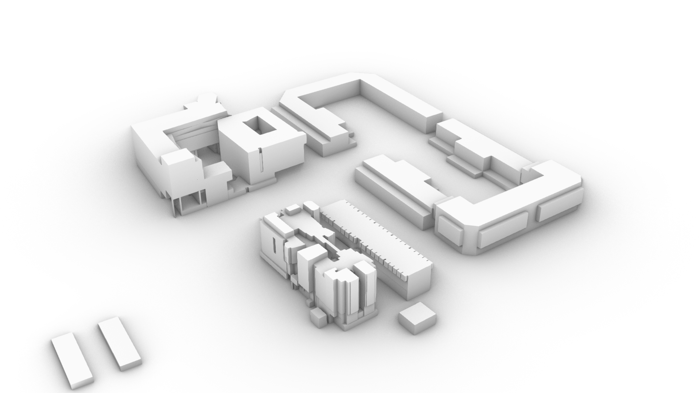
```

Le résultat révèle à la fois une **précision** et un **degré de complexité** certains du jeu de données initial, jusque-là non visualisables.

```{r echo=FALSE}
l = "Une précision et une richesse rendue visible grâce à la modélisation"
s = "Réalisation personnelle"
udfig(l=l,s=s)
```
```{r modele_3d_zoom, echo=FALSE, fig.align = 'center', out.width = "100%",fig.show='hold'}
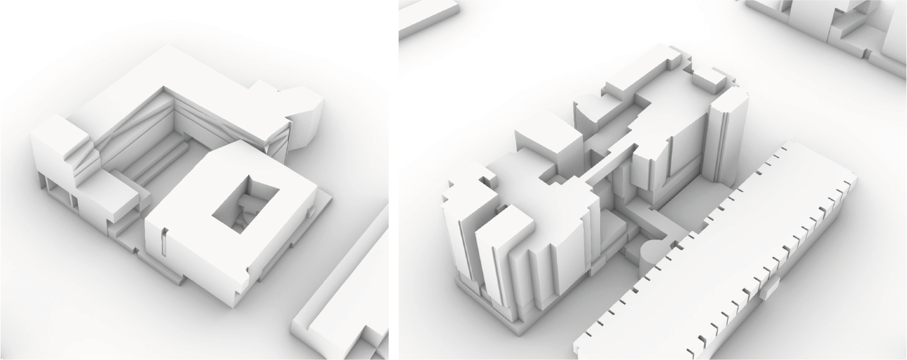
```

Bien que la syntaxe de **Rhinoinside** soit plus ardue que celle de la section précédente (dû au fait qu'il est nécessaire de s'appuyer sur de la documentation
écrite pour le langage de programmation natif de Rhinocéros, le *C#*), un architecte possédant une bonne connaissance du logiciel Rhinocéros,
et surtout de la manière logique de résoudre un problème de modélisation dans cet outil précis (surtout vis-à-vis des commandes) peut établir une stratégie viable.
\
**Cette solution a donc permis d’exploiter les données collectées à leur plein potentiel.**
\
\
**Ainsi, au-delà de permettre une simple visualisation statistique des jeux de données en Open Data, 
le langage Python apporte à l’architecte des solutions techniques variées afin de convertir les jeux de données bruts en 
fichiers synthétiques dans des formats pleinement exploitables dans son environnement de travail, de la visualisation des données interactives au modèle 3D.**
\
\
En outre, tous les scripts présentés permettent d’obtenir chacun de ces éléments en **un temps d'exécution très faible (quelques minutes tout au plus)**, 
permettant un **gain de temps considérable** une fois qu'ils ont été développés, qui ne fera que **s'accroître** à mesure qu'on les **réutilise**.
De plus, ils démontrent par leur **longueur maîtrisée** (50 lignes maximum) que ce genre de manipulations complexes 
peuvent être mises en place de manière clarifiée (grâces aux bibliothèques comme *GeoPandas*), en prolongement des concepts abordés dans le chapitre 1.
\
\
Jusqu’à lors, l’exercice a été de manipuler une infime portion d’un jeu de données ciblé autour d’un site, dans une optique « traditionnelle » de se renseigner sur un contexte immédiat.
Le prochain chapitre sera dédié à une approche plus approfondie de l’utilisation de données ouvertes, recélant cependant un intérêt certain pour la conception architecturale.

\newpage

# Agréger l'Open Data pour corréler et prédire

Comme l'a montré le jeu de données des "volumes bâtis" au sein des chapitres précédents, les jeux de données rencontrés en 
Open Data contiennent des informations sur **un seul thème**, de sorte à réduire leur taille et leur complexité afin de garder
l'ensemble le plus exploitable possible.
\
\
Or, dans le cadre de sa pratique professionnelle, l'architecte est amené à manipuler et parfois mettre en lien des informations 
portant sur des thématiques diverses (telle que le lien entre matérialité et confort thermique ou encore celui entre structure et usages possibles).
Dès lors, il existe un réel enjeu à être en capacité de **recouper des jeux de données portant sur des thématiques différentes**,
afin de les analyser de manière approfondie.
\
\
Des jeux agrégés arborant une telle richesse pourraient également leur permettre d'être employés dans le domaine de **l'Intelligence artificielle**, et tout particulièrement le **Machine Learning**,
se reposant sur des données à la fois massives et suffisamment exhaustives pour pouvoir entraîner des **modèles de prédiction**.
\
\
Certaines plateformes mettent en place des **identifiants** communs à tous leurs jeux de données, permettant d'obtenir des informations complémentaires
sur les mêmes entités étudiées (comme les bâtiments par exemple). Cependant, l'utilisateur est alors limité au choix des données que propose l'organisme en question, bien souvent 
lié à son domaine d'expertise ou d'activité.
\
\
En effet, de la même manière que chacun de ces organismes possède son propre site de mise à disposition de données en Open Data, 
si jamais certaines entités figurent de manière identique au sein de jeux de données appartenant à des plateformes différentes (comme des bâtiments par exemple),
ces dernières ne proposent aucun dispositif (tel qu'un identifiant) permettant d'identifier ces mêmes entités de manière commune. 
Autrement dit, un bâtiment que l'on identifie comme identique (bien souvent par sa localisation) 
dans plusieurs jeux de données provenant de plateformes différentes aura dans chacune d'entre elles un 
identifiant propre à la plateforme en question, ne permettant donc pas un recoupement par ce biais.
\
\
Heureusement, certaines bibliothèques Python comme **GeoPandas** (que j'ai eu l'occasion de vous présenter à plusieurs reprises au cours des 
chapitres précédents) possèdent des fonctions adaptées à l'**agrégation spatiale**, c'est-à-dire basée sur la géolocalisation.
Le langage Python figure également parmi les langages les mieux équipés pour le Machine Learning, disposant de bibliothèques 
comme **Scikit-Learn**[@sklearn] proposant une approche simplifiée à travers des algorithmes primaires, 
jusqu'aux plateformes majeures du secteur comme **TensorFlow**[@tensorflow] ou **PyTorch**[@pytorch] majoritairement basées sur ce langage proposant des 
fonctionnalités plus approfondies.
\
\
Ce chapitre présentera un exemple de travail d'**agrégation** de trois jeux de données différents, dans le but de former **un seul jeu de données
caractérisant des bâtiments de Paris et sa petite couronne** sous plusieurs aspects :

* Des informations relatives à la **typo morphologie** (nature, date de construction,hauteur, emprise géoréférencée, surface vitrée,etc.).
* Des informations relatives à leur **matérialité**
* Des **photographies**

Enfin, un aperçu des **exploitations possibles** d'un tel jeu de données sera finalement restitué au regard des capacités de Python. 

\newpage

## Présentation des données exploitées


Comme présenté en introduction, il paraît compliqué (même impossible) de trouver un jeu de données déjà constitué avec des critères aussi précis que ceux évoqués précédemment.
Il est donc effectivement nécessaire d'engager une démarche d'**agrégation**, consistant à **regrouper plusieurs jeux** de données entre eux afin de mutualiser
leurs informations en un seul et unique jeu.
\
\
Cette section sera justement dédiée à l'**énumération** des différentes sources de données accessibles en Open Data
qu'il sera nécessaire d'exploiter afin de former le jeu de données souhaité.

\newpage

### APUR : Typologie au bâti 

Tout d'abord, des jeux de données **contenant des relevés d'ordre géométrique sur l'existant** suffisamment précis ont dû être identifiés.
Dès lors, je me suis intéressé de près à la plateforme Open Data de l'**APUR** (Atelier parisien d’urbanisme) [@opendataapur], contenant des jeux de données
dans le contexte géographique à savoir le Grand Paris.
\
\
J'ai alors identifié le jeu de données intitulé **"BESOIN THEORIQUE CHAUFFAGE ET TYPOLOGIE AU BATI"** comme le plus apte à fournir des informations morphologiques.
Bien que l'objectif principal de ce jeu soit de fournir des estimations de besoins énergétiques par bâtiment sur l'existant (conformément à sa dénomination), il inclut également les **données volumiques et surfaciques**
utilisées pour le calcul de ces estimations.
Comme pour le jeu de données des volumes bâtis de l'Open Data Paris, les **polygones géolocalisés** décrivant l'emprise au sol exprimée en latitude/longitude de chaque bâtiment existant
sont inclus, la plateforme de l'APUR permettant une prévisualisation sous forme de carte.

```{r echo=FALSE}
l = "Prévisualisation des données sous forme de carte"
s = "\\url{https://www.apur.org/open_data/}"
udfig(l=l,s=s)
```
```{r carte_apur, echo=FALSE, fig.align = 'center', out.width = "100%",fig.show='hold'}
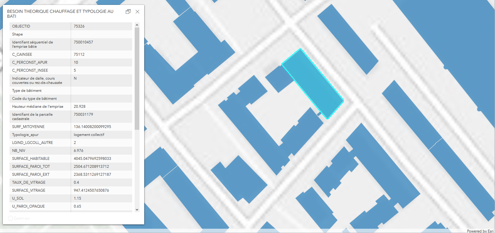
```
```{r echo=FALSE}
l = "Des variables fournissant des informations précieuses sur l'existant"
s = "\\url{https://www.apur.org/open_data/BESOIN_THEORIQUE_CHAUFFAGE_TYPO_BATI_OD.pdf}"
udfig(l=l,s=s)
```
```{r meta_apur, echo=FALSE, fig.align = 'center', out.width = "100%",fig.show='hold'}
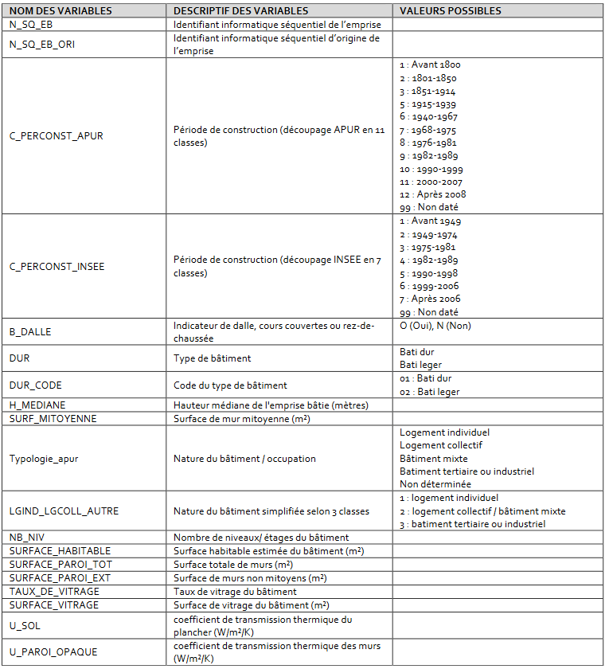
```


Ainsi, au-delà des relevés surfaciques (telles que la surface totale extérieure ou la surface de vitrage), ce jeu de données contient également des informations sur 
la **destination** ainsi que l'**époque de construction**. Il représente donc un solide point de départ pour l'agrégation.
\
\
Dès lors, un second jeu de données doit être capable de fournir des données concernant la **nature des matériaux** d'un bâtiment, l'idéal étant qu'il provienne également
de l'*APUR* afin de faciliter son recoupement via un identifiant propre à chaque bâtiment, commun aux deux jeux de données.
Or, un tel jeu n'existe actuellement pas dans la base de l'*APUR*, ce qui contraint d'étendre les recherches vers d'autres plateformes.
\

\newpage

### IGN : Base de Données Topographique (BD TOPO)

Un autre jeu contenant des informations sur le bâti existe cependant sur une autre plateforme en Open Data mise en place par l'**IGN**, intitulé la **BD TOPO**.
Cette dernière est une base de données vectorielle à l'échelle nationale constituée de plusieurs **couches de données cartographiées et géolocalisées sur de multiples domaines**,
tels que les tracés des limites administratives, les infrastructures de transports, l'hydrographie et plus particulièrement **le bâti**.
La plateforme d'IGN ne proposant pas de moyens de prévisualisation, les métadonnées seront consultées dans un premier temps.

```{r echo=FALSE}
l = "Extrait des métadonnées : attributs pour chaque bâtiment dans la BD TOPO"
s = "\\url{https://qlf-geoservices.ign.fr/ressources_documentaires/Espace_documentaire/BASES_VECTORIELLES/BDTOPO/DC_BDTOPO_3-0.pdf}"
udfig(l=l,s=s)
```
```{r meta_ign, echo=FALSE, fig.align = 'center', out.width = "100%",fig.show='hold'}
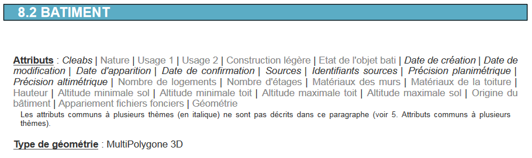
```
Dès lors, ces données contiennent des attributs qui complètent à merveille les données géométriques provenant de l'*APUR*, à savoir
les **matériaux des murs** ainsi que les **matériaux de toiture**.

```{r echo=FALSE}
l = "Extrait des métadonnées : détail des attributs concernant les matériaux"
s = "\\url{https://qlf-geoservices.ign.fr/ressources_documentaires/Espace_documentaire/BASES_VECTORIELLES/BDTOPO/DC_BDTOPO_3-0.pdf}"
udfig(l=l,s=s)
```
```{r meta_ign_2, echo=FALSE, fig.align = 'center', out.width = "100%",fig.show='hold'}
include_graphics("__imgs/meta_ign_2.png")
```
```{r echo=FALSE}
l = "Extraits des tables des matériaux pour les murs (gauche) et les toitures (droite)"
s = "\\url{http://piece-jointe-carto.developpement-durable.gouv.fr/NAT004/DTerNP/html3/annexes/}"
udfig(l=l,s=s)
```
```{r mats, echo=FALSE, fig.align = 'center', out.width = "100%",fig.show='hold'}
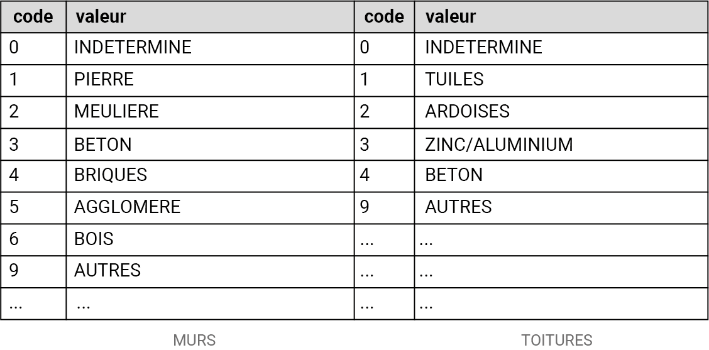
```

Un petit script Python sera ici utilisé ci-dessous afin
de visualiser les données associées à un bâtiment grâce au module *GeoPandas* à partir du fichier des bâtiments au format ShapeFile 
contenu dans la base de données une fois téléchargée.
```{r echo=FALSE}
l = "Lecture des attributs du bâti de la BD TOPO"
udfig(l=l)
```
```{python}
import geopandas as gpd
data = gpd.read_file("F:\\BD_TOPO_IDF_\\BATI\\BATIMENT.shp")
print(data.columns)
```

Dès lors, le jeu actuel ne possédant bel et bien aucun attribut à caractère identifiant en commun avec le jeu de données de l'*APUR*,
les **coordonnées terrestres** de l'emprise représentent **le seul moyen** envisageable de les recouper, de sorte que les attributs concernant les matériaux dans la *BD TOPO* soient
ajoutés au jeu de l'*APUR*. En l'occurrence, les coordonnées ci-dessus sont exprimées selon la projection **Lambert93**, que l'on peut aisément manipuler grâce à Python comme l'ont montré les
chapitres précédents.
\
\

\newpage

### IGN : Base de Données Orthographique (BD ORTHO)

Enfin, la dernière étape consiste à fournir des **photographies** de chaque bâtiment. 
Puisque l'on se situe dans une optique d'exploitation des données, certains critères doivent alors absolument être remplis :

* Ces images doivent être **disponibles pour une grande majorité des bâtiments** et être facilement **accessibles**

* Les photographies doivent être prises du **même point de vue**

* De préférence, chaque bâtiment sujet doit pouvoir être **isolé** (sur un fond blanc ou noir par exemple) afin d'améliorer sa détection.

\
Il semble alors qu'actuellement, le type d'imagerie remplissant ces trois critères soit l'**imagerie aérienne**.
Ainsi, le jeu de données **BD ORTHO HR** provenant du même organisme que le jeu précédent (IGN) sera ici exploité.
C'est une base de données constituée d'un quadrillage de photographies aériennes en haute définition (de forme carrée de 25000 pixels de côté), dont chaque 
carreau représente 5 kilomètres de côté. Chacun d'entre eux possède un fichier annexe où l'on retrouve des informations permettant de le géolocaliser.
\
\
Ceci permettra donc d'isoler pour chaque bâtiment (dont on dispose des coordonnées de l'emprise) une **photographie découpée** à partir de ces carreaux. 

```{r echo=FALSE}
l = "Extrait d'un carreau de la BD ORTHO (gauche) et ses données de géolocalisation (droite)"
s = "\\url{https://geoservices.ign.fr/}"
udfig(l=l,s=s)
```
```{r bd_ortho, echo=FALSE, fig.align = 'center', out.width = "100%",fig.show='hold'}
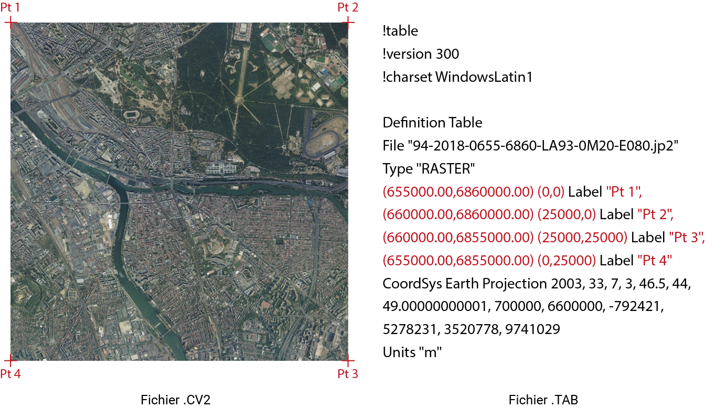
```
\
\
Ainsi, dans l'objectif de créer un jeu de données regroupant suffisamment d'informations concernant les caractéristiques
géométriques des bâtiments existants et la nature de leurs principaux matériaux, il s'avère nécessaire de recouper des jeux de données produits par des
**organismes différents**. De plus, les **types de données** à manipuler sont hétérogènes, puisque
des **images** viendront compléter des données **alphanumériques** (sous forme de texte ou de nombres).
L'enjeu du langage Python est donc ici de permettre ce **recoupement** de manière accessible.

\newpage

## Une agrégation spatiale facilitée grâce à Python

Dès lors, en l'absence d'identifiant en commun, il est nécessaire de réaliser une agrégation de données basées sur les **coordonnées** 
de deux entités identiques appartenant à des jeux différents.
Dans un premier temps, elle sera appliquée entre les jeux de données de l'**APUR** et de la **BD TOPO**. L'extraction des images sera quant à elle 
réalisée dans un second temps.

\newpage

### L'enjeu de l'apurement

Puisque certaines informations contenues dans les jeux de données exploités ne seront pas utilisées,
il est fortement recommandé de les **supprimer** avant recoupement, afin de réduire la taille du jeu
en lui-même au maximum qui se répercutera sur le temps d'exécution. 
Toute valeur **indésirable** dans les attributs que l'on souhaite conserver peut également être supprimée
lors de ce cette étape.
\
\
Ainsi, pour les jeux de données de l'**APUR** et de la **BD TOPO**, une copie sera réalisée dans un autre dossier
après cette phase d'apurement.
\
\
La bibliothèque *GeoPandas* facilite ici énormément les apurements, en permettant d'inscrire directement
des conditions à remplir pour chacune des colonnes.


```{r echo=FALSE}
l = "Apurement du jeu de données issu de l'APUR"
udfig(l=l)
```
```{python  eval = FALSE, collapse=TRUE}
import geopandas as gpd
# Chargement du jeu de données
apur = gpd.read_file("F:\\DATABASE\\APUR\\BESOIN_THEORIQUE_CHAUFFAGE_ET_TYPOLOGIE_AU_BATI.geojson")
# Changement de projection vers Lambert93
apur.crs = 4326
apur = apur.to_crs(2154)

# Liste des attributs à conserver
attributs_apur = [
    "geometry",
    "SURFACE_VITRAGE",
    "SURFACE_HABITABLE",
    "C_PERCONST_APUR", # Période de construction
    "Shape_Area", # Surface
    "SURFACE_PAROI_TOT",
    "NB_NIV", # Nombre de niveaux
    "H_MEDIANE", # Hauteur
    "Typologie_apur" # Type d'usage
    ]
# Suppression des autres colonnes
apur = apur[attributs_apur]
# Suppression des bâtiments ayant une valeur nulle dans un des attributs
apur = apur.dropna()
# Suppression des bâtiments ayant un nombre de niveaux supérieur à 1
# Ainsi qu'une date de construction "indéfinie"
apur = apur[(apur["NB_NIV"] >= 1) & (~apur["C_PERCONST_APUR"].isin([99,"99"]))]
```

Concernant le jeu de données de l'**APUR**, après avoir changé son système de coordonnées de référence vers 
**Lambert93**, une liste d'attributs à conserver a été définie. Celle-ci contient toutes les informations jugées
utiles lors de la lecture du jeu de données de la section précédente.
\
\
Le jeu de données est alors dans un premier temps réduit à ces attributs. Tous les bâtiments 
ayant une valeur nulle dans l'un de ces derniers sont ensuite supprimés automatiquement grâce à la fonction *dropna()*.
\
\
Une dernière séquence de suppression prend en charge quant à elle certaines **valeurs particulières**.
En l'occurrence, on s'assure de ne disposer d'aucun bâtiment de moins de 1 niveau de hauteur, ainsi que d'aucun
bâtiment dont la date de construction est non connue.

```{r echo=FALSE}
l = "Décodage des attributs"
udfig(l=l)
```
```{python eval=FALSE}
table_periodes = {
  1: "Avant 1800",
  2: "1801-1850",
  3: "1851-1914",
  4: "1915-1939",
  5: "1940-1967",
  6: "1968-1975",
  7: "1976-1981",
  8: "1982-1989",
  9: "1990-1999",
  10: "2000-2007",
  11: "Après 2008"
}
# Décodage de la période de construction
apur["C_PERCONST_APUR"] = apur["C_PERCONST_APUR"].map(table_periodes)
# Enregistrement du jeu apuré dans un nouveau fichier
apur.to_file("F:\\BASES_APUREES\\APUR_APURÉ")
```
Enfin, les valeurs de la colonne *C_PERCONST_APUR*, désignant la période de construction seront **explicitées**,
en appliquant un **dictionnaire** (associant chaque valeur et son équivalent textuel) sur la colonne entière avec la fonction *.map()*.
Le jeu de données apuré peut ensuite être enregistré.

```{r echo=FALSE}
l = "Apurement du jeu de données BD TOPO"
udfig(l=l)
```
```{python eval=FALSE}
# Chargement du jeu de données
bdtopo = gpd.read_file("F:\\BD_TOPO_IDF\\BATI\\BATIMENT.shp")
# Filtrage selon les attributs ayant attrait aux matériaux
bdtopo = bdtopo[
    # Suppression des valeurs "AUTRES"
    (~bdtopo["MAT_MURS"].isin(["9","09","90","99","00","0"])) & 
    (~bdtopo["MAT_TOITS"].isin(["9","09","90","99","00","0"])) & 
    # Suppression du bâti non-dur
    (bdtopo["LEGER"] == "Non")
    ]
# Réduction du jeu de données à l'emprise
# et les informations de matérialité
bdtopo = bdtopo[["geometry","MAT_MURS","MAT_TOITS"]]
# Suppression des valeurs nulles
bdtopo = bdtopo.dropna()
```

L'apurement du jeu de données de la **BD TOPO** est quant à lui davantage centré sur les attributs ayant attrait aux
matériaux. Dès lors, le code ci-dessus permet de s'assurer que tous les bâtiments possèdent bel et bien des informations
concernant leur **matérialité** (de sorte qu'elles soient définies). C'est pourquoi la valeur *AUTRES* est aussi supprimée,
de même que le bâti léger (non dur).
\
\


Le jeu de données peut ensuite être réduit aux colonnes correspondantes à l'emprise, aux matériaux de façade ainsi qu'aux matériaux
de toiture.

```{r echo=FALSE}
l = "Décodage des notations des matériaux"
udfig(l=l)
```
```{python eval=FALSE}
def decodage_mur(mat_mur):
  # Pierre
  if mat_mur in ["1","01","10","11","19","91"]:
      mat_mur = "Pierre"
  # Meulière
  elif mat_mur in ["2","02","12","20","21","22","29","92"]:
      mat_mur = "Meulière"
  # Béton
  elif mat_mur in ["3","03","13","23","30","31","32","33","34","36","39","43","63","93"]:
      mat_mur = "Béton"
  # Briques
  elif mat_mur in ["4","04","14","24","40","41","42","44","49","94"]:
      mat_mur = "Briques"
  # Aggloméré
  elif mat_mur in ["5","05","15","25","35","45","50","51","52","53","54","55","56","59","65","95"]:
      mat_mur = "Aggloméré"
  # Bois
  elif mat_mur in ["6","06","16","26","46","60","61","62","64","66","96","69"]:
      mat_mur = "Bois"  
  return mat_mur

def decodage_toit(mat_toit):
  # Tuiles
  if mat_toit in ["1","01","10","11","13","19","31","91"]:
      mat_toit = "Tuiles"
  # Ardoises
  elif mat_toit in ["2","02","12","20","21","22","23","24","29","32","42","92"]:
      mat_toit = "Ardoises"
  # Zinc/Aluminium
  elif mat_toit in ["3","03","30","33","39","93"]:
      mat_toit = "Zinc/Aluminium"
  # Béton
  elif mat_toit in ["4","04","14","34","40","41","43","44","49","94"]:
      mat_toit = "Béton_toit"  
  return mat_toit

# Application des fonctions de décodage
bdtopo["MAT_TOITS"] = bdtopo["MAT_TOITS"].map(decodage_toit)
bdtopo["MAT_MURS"] = bdtopo["MAT_MURS"].map(decodage_mur)
# Enregistrement du jeu apuré dans un nouveau fichier
bdtopo.to_file("F:\\BASES_APUREES\\BDTOPO_APURÉ")
```

Enfin, le code ci-dessus effectue une dernière opération, visant à **expliciter** chaque matériau, en ne conservant que le matériau principal,
d'après les tables des matériaux montrées dans la section précédente.
Ces transformations sont effectuées par deux fonctions appliquées aux colonnes *MAT_MURS* et *MAT_TOITS*, dans lesquelles les conditionnels
**if** et **elif** (contraction de *else* et *if*) affectent la bonne valeur au bon texte.
Enfin, le jeu de données peut être sauvegardé.
\
\
Ainsi, la taille du jeu de données de l'**APUR** a pu être réduite de 1.6Go à 310Mo, tandis que celui de la **BD TOPO**
est passé d'une taille de 3Go à 620Mo. Ces réductions de volume sont donc conséquentes, et permettront un gain notable
en temps d'exécution.
\
\
Une fois ces jeux de données réduits à leurs valeurs utiles, la phase de recoupement en elle-même peut être mise en oeuvre.

\newpage

### L'intersection géométrique

```{r echo=FALSE}
l = "Principe de l'agrégation géométrique"
s = "Réalisation personnelle"
udfig(l=l,s=s)
```
```{r principe_agg, echo=FALSE, fig.align = 'center', out.width = "100%",fig.show='hold'}
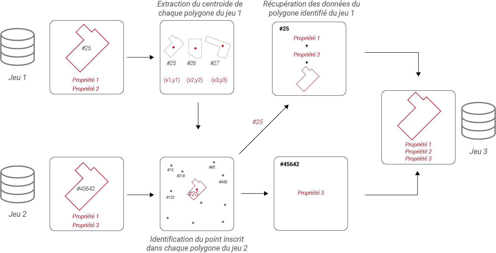
```

\
Dès lors, pour une même entité réelle (ici, un bâtiment), deux formes géométriques géolocalisées peuvent légèrement différer, et ce
pour plusieurs raisons, telles que la précision du relevé ou encore une éventuelle différence de mises à jour.
L'un des deux objets géométriques sera donc réduit en un point, son **centroïde** (soit l'approximation géométrique de son centre).
Ainsi, il suffit alors de déterminer **quel polygone** contient le centroïde en question, afin de retrouver son homologue
dans le second jeu de données.
\
\
La première étape consiste donc à déterminer quel jeu de données sera réduit à ses centroïdes, et lequel conservera ses polygones.
En l'occurrence, puisque le jeu de données de l'**APUR** contient la majorité des données à extraire, c'est celui de la
**BD TOPO** qui sera réduit à ses centroïdes.
\
\
Afin d'effectuer l'intersection des deux jeux de données, une seule fonction de *GeoPandas* sera nécessaire, nommée *sjoin()* (spatial join).
Cependant, il est nécessaire que les deux jeux à recouper contiennent le même type de géométrie.
Dès lors, les bâtiments de l'APUR étant des polygones, chaque centroïde de la *BD TOPO* sera substitué par une forme géométrique de taille 
très réduite, de sorte qu'il compte comme un polygone, sans impacter la méthodologie de départ. 
Ainsi, dans le code ci-dessous, un cercle de 10cm de rayon remplacera chaque polygone de la *BD TOPO*, construit à partir des centroïdes.

```{r echo=FALSE}
l = "Chargement des données et calcul des centroïdes"
udfig(l=l)
```
```{python eval=FALSE}
apur = gpd.read_file("F:\\BASES_APUREES\\APUR_APURÉ\\APUR_APURÉ.shp")
bdtopo = gpd.read_file("F:\\BASES_APUREES\\BDTOPO_APURÉ\\BDTOPO_APURÉ.shp")
# Remplacement de chaque polygone dans la colonne "geometry"
# par un cercle de 10cm autour de son centroïde
bdtopo["geometry"] = bdtopo["geometry"].apply(lambda poly : poly.centroid.buffer(0.1))
```


Une fois cette étape effectuée, la seule commande *sjoin()* de *GeoPandas* suffit à effectuer l'intersection des deux jeux,
en spécifiant l'argument *"inner"*. 
Afin de faire sorte que seuls les éléments géométriques du jeu de données de l'APUR soit gardés (ici, les bâtiments),
celui-ci sera référencé en premier dans la fonction *sjoin()* suivi de celui de la BD TOPO.

```{r echo=FALSE}
l = "Calculs d'inclusion géométrique et sauvegarde du jeu agrégé"
udfig(l=l)
```
```{python eval=FALSE}
# Listes des résultats des calculs d'inclusion
intersection = gpd.sjoin(apur,bdtopo, how='inner')
intersection = intersection.drop(columns=["index_right"])
intersection['id'] = intersection.index
# Sauvegarde du jeu agrégé
intersection.to_file("F:\\BASES_APUREES\\JEU_AGG")
```

Enfin, *GeoPandas* créant automatiquement une colonne référençant la position originelle des éléments agrégés
dans le second jeu de données (ici, la BD TOPO), elle sera supprimée, car superflue, et remplacée
dans la ligne suivante par une colonne *id*, numérotant simplement chaque bâtiment du nouveau jeu, qui 
peut enfin être sauvegardé. Un aperçu est présenté dans le code ci-dessous.
\
```{r echo=FALSE}
l = "Aperçu du jeu de données agrégé"
udfig(l=l)
```
```{python}
apur = gpd.read_file("F:\\BASES_APUREES\\JEU_AGG")
print(apur.head(3))
```
\
\
Dès lors, les dernières informations à obtenir afin de compléter ce nouveau jeu de données obtenu
sont les **photographies aériennes** de chacun des bâtiments.
\

```{r echo=FALSE}
l = "Principe de l'extraction des photographies aériennes"
s = "Réalisation personnelle"
udfig(l=l,s=s)
```
```{r principe_photo, echo=FALSE, fig.align = 'center', out.width = "100%",fig.show='hold'}
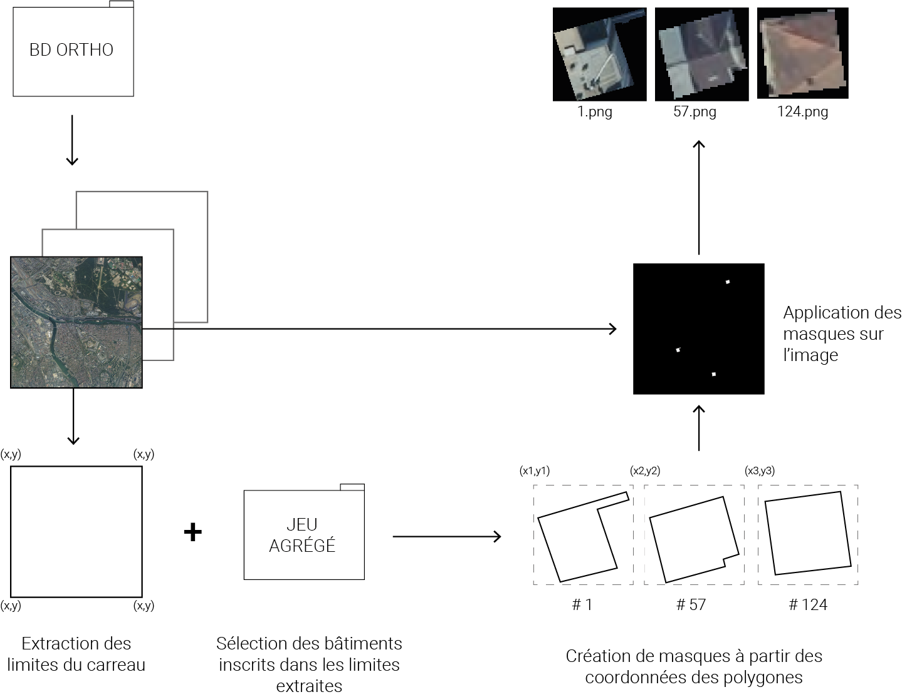
```

Le principe d'extraction repose sur l'application de **masques** définis selon les coordonnées de chaque bâtiment sur les différentes photographies
aériennes.
Cependant, étant découpées en **carreaux géoréférencés**, il est nécessaire au préalable d'identifier les bâtiments présents sur chacun de ces
carreaux.
\
\
Heureusement, *GeoPandas* permet de charger un jeu de données selon une *"Bounding Box"* définie par quatre points,
de sorte à ne charger que les entités inscrites au sein de ce rectangle. 
Ainsi, pour chaque carreau, les coordonnées de ses extrémités seront fournies à *GeoPandas* avant l'application des masques.
\
\
```{r echo=FALSE}
l = "Import des bibliothèques et ressources"
udfig(l=l)
```
```{python eval=FALSE}
import geopandas as gpd
import rasterio
from rasterio.mask import mask
import os
# Dossier des carreaux de la BD ORTHO
dossier_bdortho = "F:\\ORTHO_94"
# Dossier des futures images
dossier_photos = "F:\\BASES_APUREES\\JEU_AGG\\PHOTOS"
# Énumération des fichiers de la BD ORTHO
fichiers = os.listdir(dossier_bdortho)
```

Une bibliothèque nommée **Rasterio**, spécialisée dans la manipulation de données géographiques sous forme d'images,
sera ici importée afin de gérer le chargement des photographies de la **BD ORTHO**, la sauvegarde des images de chaque bâtiment
ainsi que l'application des masques puis le rognage automatique.
Deux dossiers, l'un référençant l'emplacement où sont stockés les différents carreaux de la **BD ORTHO**,
tandis que l'autre référence le répertoire d'enregistrement des images.
Enfin, la fonction *listdir()* de la bibliothèque **os** permet d'énumérer les différents fichiers contenus dans le dossier 
de la *BD ORTHO*, dont les carreaux.

```{r echo=FALSE}
l = "Extraction des photographies"
udfig(l=l)
```
```{python eval=FALSE}
# Itération à travers les fichiers
for f in fichiers:
  # Si le fichier est un carreau au format .jp2
  if f.endswith(".jp2"):
    # Chargement du carreau en question
    carreau = rasterio.open(os.path.join(dossier_bdortho,f))
    # Extraction des coordonnées de ses limites
    limites = carreau.bounds
    # Chargement du jeu de données agrégé selon les limites données
    batis = gpd.read_file("F:\\BASES_APUREES\\JEU_AGG\\JEU_AGG.shp",bbox=limites)
    # Itération à travers les bâtiments
    for i,bati in batis.iterrows():
      # Application du masque et rognage automatique
      img,trs = mask(carreau,[bati["geometry"]],crop=True,pad=True)
      # Définition du nom de l'image selon l'identifiant du bâtiment
      path = os.path.join(dossier_photos,"%i.png"%bati["id"])
      # Définition des propriétés de l'image sauvegardée
      with rasterio.open(path,"w",transform=trs,dtype=rasterio.uint8,driver="PNG",height=60,width=60,count=3) as p:
        # Sauvegarde de l'image du bâtiment
        p.write(img)
```

Pour chaque fichier au format **jp2** (celui des carreaux), ce dernier est chargé, puis ses limites sont extraites afin
de les fournir à *GeoPandas* pour l'import du jeu de données agrégé.
Ensuite, *Rasterio* génère une image automatiquement rognée à partir des coordonnées chaque bâtiment en appliquant la fonction *.mask()*,
puis cette dernière est enregistrée en portant comme nom son identifiant au sein du jeu de données.
\
\
Ici, toutes les images enregistrées sont réduites à une taille de **60 par 60 pixels**.
Cette transformation est effectuée par anticipation afin que ces images puissent être plus facilement traitées au sein d'algorithmes.
\

```{r echo=FALSE}
l = "Aperçu du jeu de données agrégé final"
s = "Réalisation personnelle"
udfig(l=l,s=s)
```
```{r agg_final, echo=FALSE, fig.align = 'center', out.width = "100%",fig.show='hold'}
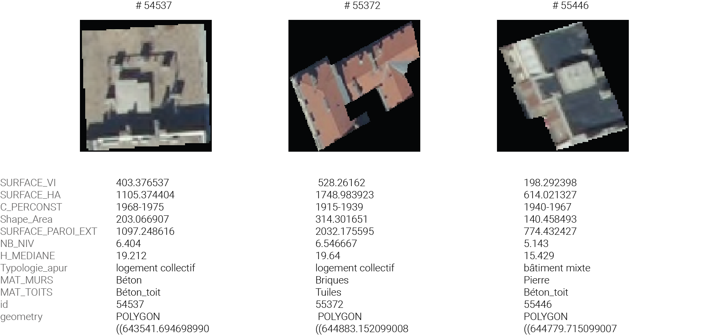
```


Ainsi, cette section a démontré l'aisance avec laquelle le langage Python permet d'effectuer des **apurements** ainsi
que des **agrégations** complexes (mêlant de nombreux formats de données), à travers un usage plus approfondi néanmoins toujours **clair** des bibliothèques comme
**GeoPandas**.

\newpage

## Approche pratique et accessible de l'IA

Cette dernière section aura pour objectif de présenter différentes pistes d'exploitation d'un tel jeu de données, orientées sur le domaine de l'Intelligence
artificielle.
Ces exemples ont davantage pour but de démontrer la capacité des outils actuels permettant de les mettre en oeuvre et les rendre exploitables 
que d'être utiles en soi.
Plus précisément, deux éléments seront ici produits, à savoir une **matrice de corrélation**, ainsi qu'un **modèle de prédiction**.

\newpage

### La matrice de corrélation

Une **matrice de corrélation** représente un moyen d'étudier le **degré de dépendance** entre deux variables, au sein d'un ensemble complexe.
Sa représentation graphique est une matrice **comportant les mêmes variables sur chaque dimension**, et comportant dans chaque case le **coefficient
de corrélation** entre -1 et 1 entre les deux variables qui s'y croisent.
Afin de rendre la matrice plus lisible, chaque coefficient peut être associé à une **couleur** suivant sa valeur, de sorte à créer un **corrélogramme** ou une
**Heatmap**.
\
\
L'objectif fixé ici sera ici d'identifier les liens entre **la nature d'un bâtiment** et ses **caractéristiques** au sein du jeu de données.
\
\
La bibliothèque *GeoPandas* possède le moyen de calculer automatiquement les coefficients de corrélation avec la fonction *.corr()*.
Cependant, c'est la bibliothèque *Plotly* (introduite dans le chapitre 2) qui permettra ici de construire le corrélogramme.
Ce dernier ne pouvant être établi qu'entre des données **numériques**, chaque valeur de l'attribut *Typologie_apur*,exprimé jusqu'alors sous forme de 
 texte devra d'abord être convertie en notation numérique. Autrement dit, il faut réaliser un **encodage**.
La fonction *get_dummies()* de la bibliothèque *Pandas* (sur laquelle est basée *GeoPandas*) sera utilisée pour remplir cette fonction,
en générant **une colonne par valeur différente*, avec deux valeurs numériques possibles, 0 ou 1.

```{r echo=FALSE}
l = "Illustration de l'encodage réalisé"
s = "Réalisation personnelle"
udfig(l=l,s=s)
```
```{r encode, echo=FALSE, fig.align = 'center', out.width = "100%",fig.show='hold'}
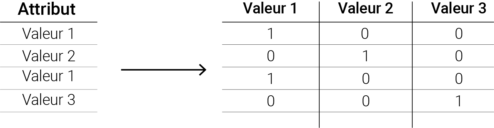
```
Cette fonction sera également appliquée aux attributs *MAT_MURS*, *MAT_TOITS* ainsi qu'à *C_PERCONST_APUR*.
Enfin, la colonne *id* sera abandonnée, car inutile.

```{r echo=FALSE}
l = "Préparation des données"
udfig(l=l)
```
```{python eval=FALSE}
import geopandas as gpd
import pandas
import plotly.express as px
# Chargement du jeu agrégé
batis = gpd.read_file("F:\\BASES_APUREES\\JEU_AGG\\JEU_AGG.shp")
# Encodage des valeurs de "Typologie_apur"
typo = pandas.get_dummies(batis["Typologie_"])
# Encodage des valeurs de "MAT_MURS"
matm = pandas.get_dummies(batis["MAT_MURS"])
# Encodage des valeurs de "MAT_TOITS"
matt = pandas.get_dummies(batis["MAT_TOITS"])
# Encodage des valeurs de "C_PERCONST_APUR"
perconst = pandas.get_dummies(batis["C_PERCONST"])
# Intégration des nouvelles colonnes
batis = batis.join([typo,matm,matt,perconst])
# Abandon de l'identifiant
batis = batis.drop(columns=["id"])
```

Le corrélogramme peut ensuite être tracé, selon une échelle de couleur
où une **forte corrélation** sera représentée par des **couleurs chaudes**, tandis que les plus **faibles** le seront par des
couleurs **froides** 

```{r echo=FALSE}
l = "Construction du corrélogramme"
udfig(l=l)
```
```{python eval=FALSE}
# Calcul des coefficients de corrélation
correlation = batis.corr()
# Construction du corrélogramme
fig = px.imshow(
    correlation,
    color_continuous_scale='RdBu_r')
# Export du corrélogramme
fig.write_html("OUTPUT/matrice_corrélation.html")
```
```{r echo=FALSE}
l = "Matrice de corrélation du jeu de données agrégé"
s = "Réalisation personnelle"
udfig(l=l,s=s)
```
```{r matrice_corr, echo=FALSE, fig.align = 'center', out.width = "100%",fig.show='hold'}
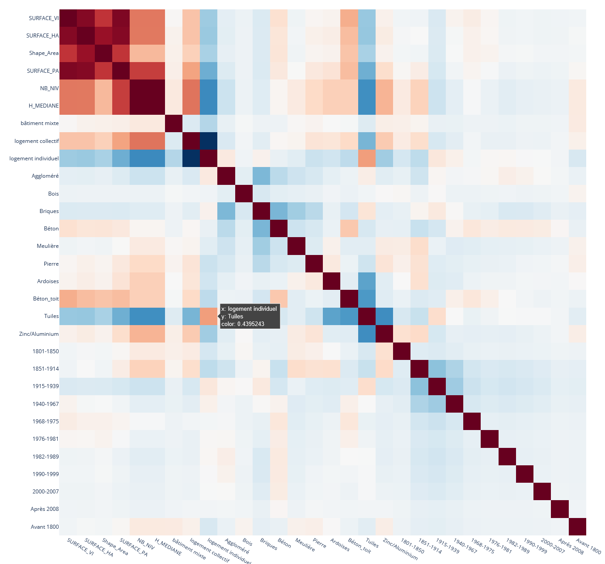
```

Grâce au format HTML, la lecture d'une telle matrice est facilitée, les coefficients pouvant
être contrôlés au survol comme le montre l'illustration ci-dessus.
Cependant, il est possible d'être plus spécifique et d'isoler les colonnes relatives à **la nature d'un bâtiment**.

```{r echo=FALSE}
l = "Spécification du corrélogramme"
udfig(l=l)
```
```{python eval=FALSE}
# Sélection spécifique dans la matrice
correl_nature = correlation[[
    "bâtiment mixte",
    "logement collectif",
    "logement individuel"
    ]]
# Construction du second corrélogramme
fig2 = px.imshow(
    correl_nature,
    color_continuous_scale='RdBu_r')
# Export du second corrélogramme
fig2.write_html("OUTPUT/matrice_corrélation_nat.html")
```
```{r echo=FALSE}
l = "Matrice de corrélation spécifique"
s = "Réalisation personnelle"
udfig(l=l,s=s)
```
```{r matrice_corr_nat, echo=FALSE, fig.align = 'center', out.height = "90%",fig.show='hold'}
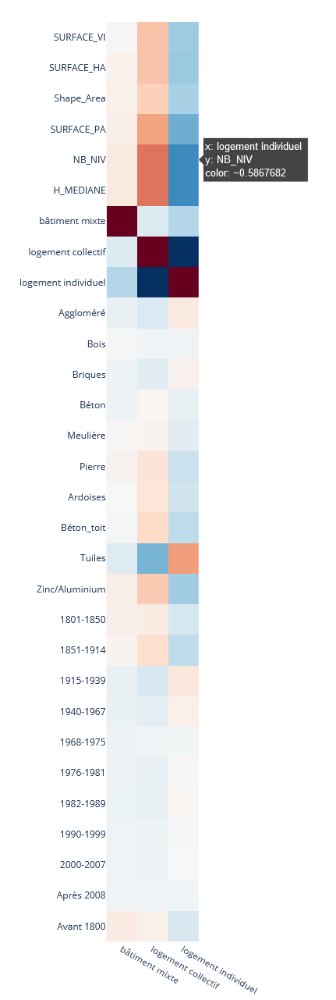
```

Dès lors, quelques observations peuvent être notées (relativement au contexte de référence, à savoir Paris et la Petite Couronne) :

* La typologie du bâtiment mixte ne possède quasiment aucun attribut avec laquelle elle serait fortement liée ou non,
sûrement dû à une répartition **hétérogène** de sa population.

* Sans surprise, quant aux informations morphologiques, logement individuel et collectif s'opposent, surtout au niveau de la hauteur.

* Les coefficients liés aux matériaux suggèrent quelques corrélations marquées : tandis que le logement individuel
est fortement identifié aux toitures en tuiles, le logement collectif l'est aux toitures en béton et aux couvertures en zinc ou aluminium, et inversement.
D'autres corrélations mineures peuvent être notées sans pour autant être marquées, comme un lien légèrement plus fort 
entre le logement individuel et l'aggloméré et la brique en tant que matériaux de façade qu'avec le logement collectif.

* Enfin, les époques de construction les plus récentes ne semblent pas significatives.
En revanche, on peut noter un léger lien entre l'époque de 1915 à 1939 pour le logement individuel,
tandis que le logement collectif semble plus ancien (avec un léger lien entre (1851 et 1914).


Ainsi, le langage Python prouve sa capacité à pouvoir mettre en évidence des **liens multi variables** à partir de jeux de données complexes,
en prodiguant des outils de **prétraitement** ainsi que de **traçage** très simples à manipuler, permettant néanmoins de construire des
documents à la fois synthétiques et riches.
\
\
Bien qu'à l'échelle des bâtiments, il n'existe pas encore de jeux de données relatifs à des **thèmes plus variés**,
des **outils d'exploitation accessible** sont d'ores et déjà présents.

\newpage

### Le modèle de prédiction

Comme mentionné dans l'introduction de ce chapitre, un enjeu autour de l'entraînement d'algorithmes prédictifs est présent autour
des jeux de données massifs agrégés.
\
\
Ici, le but sera d'exploiter l'**imagerie aérienne** extraite afin d'entraîner un **réseau de neurones convolutif**,
capable d'identifier **son matériau de toiture**. Ce modèle de prédiction pourra être alors utilisé dans un autre contexte géographique.
\
\
Bien que cette section ne  détaille pas le fonctionnement d'un tel réseau de neurones, le schéma ci-dessous présentera néanmoins son 
**principe d'utilisation**, et plus précisément ce qu'il est nécessaire de fournir en **entrée** et ce que l'on obtient en **sortie** lors des différentes phases.
En effet, je démontrerai plus loin que le réseau en lui-même peut être traité comme une "boîte noire", le langage Python disposant
de bibliothèques permettant de gérer automatiquement ses paramètres internes.

```{r echo=FALSE}
l = "Représentation simplifiée de l'utilisation d'un réseau de neurones convolutif"
s = "Réalisation personnelle"
udfig(l=l,s=s)
```
```{r cnn_schema, echo=FALSE, fig.align = 'center', out.height = "90%",fig.show='hold'}
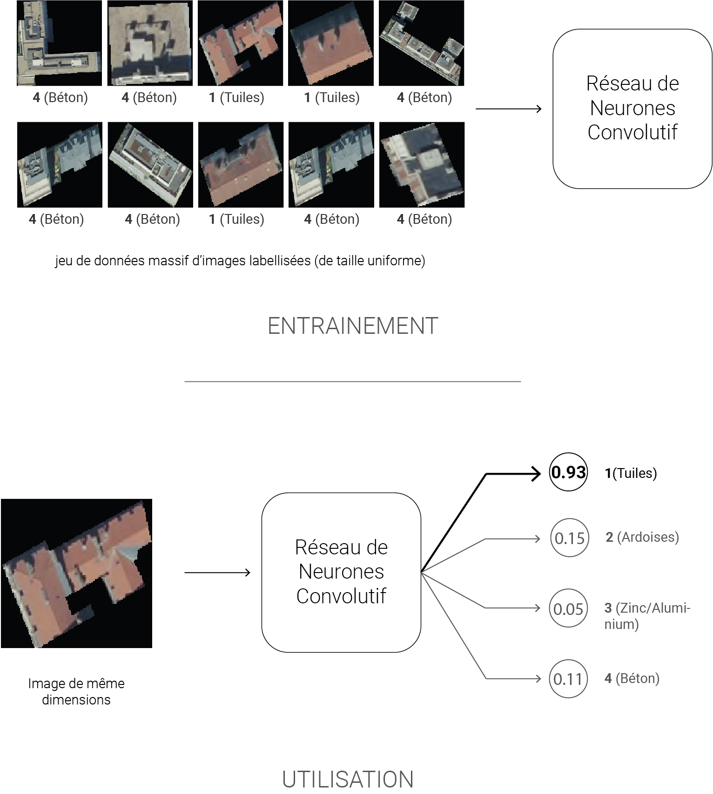
```

Comme le montre le schéma, il sera nécessaire d'**encoder** les différents matériaux de toiture en valeurs numériques,
étant donné qu'un réseau de neurones nécessite impérativement des valeurs numériques.
Ici, l'approche la plus simple est de fournir notre propre table d'encodage, et l'appliquer
sur le jeu de données entier grâce à la fonction *.map()*, afin d'obtenir une notation numérique.

```{r echo=FALSE}
l = "Encodage des matériaux de toiture"
udfig(l=l)
```
```{python eval=FALSE}
import geopandas as gpd
# Chargement du jeu agrégé
batis = gpd.read_file("F:\\BASES_APUREES\\JEU_AGG\\JEU_AGG.shp")
table_periodes = {
  "Tuiles": 0,
  "Ardoises": 1,
  "Zinc/Aluminium": 2,
  "Béton_toit": 3,
}
# Encodage de la période de construction
batis["MAT_TOITS"] = batis["MAT_TOITS"].map(table_periodes)
```
Il est ensuite nécessaire de charger les images correspondantes à chaque bâtiment.
Ceci sera effectué grâce à une fonction appliquée à l'ensemble du jeu de données,
qui utilisera les fonctions **try** et **except** de Python, ainsi que les bibliothèques **PIL** et **numpy**, afin de charger les images puis de les convertir
en matrices (contenant les valeurs RGB de chaque pixel de l'image, pouvant alors être fournie au réseau de neurones).
Si l'image n'existe pas, une valeur nulle est affectée dans la colonne *photo*. 

```{r echo=FALSE}
l = "Chargement des images"
udfig(l=l)
```
```{python eval=FALSE}
from PIL import Image
import numpy as np
# Dossier des photos aériennes
dossier_photos = "F:\\BASES_APUREES\\JEU_AGG\\PHOTOS"

def charger_photo(bati):
    # Chemin de l'image associée au bâtiment
    path = dossier_photos+"\\"+str(bati["id"])+".png"
    try:
        # Essaye de charger l'image
        # et de l'inclure dans une colonne "photo"
        # sous forme de matrice
        img = Image.open(path)
        bati["photo"] = [np.asarray(img)]
    except:
        # Si l'image nexiste pas
        bati["photo"] = None
    return bati

# Chargement des images
batis = batis.apply(charger_photo,axis=1)
# Filtrage des bâtiments sans images
batis = batis.dropna()
```

Enfin, les colonnes *MAT_TOITS* et *photo* sont prêtes à être fournies
à un réseau de neurones vierge, dont *AutoKeras* se chargera lui-même du paramétrage et de l'entraînement 
(avec l'aide de la bibliothèque *TensorFlow*, que l'utilisateur n'est pas amené à manipuler).
**Quelques lignes suffisent alors à définir toute cette séquence**.
Enfin, le modèle pourra être sauvegardé.

```{r echo=FALSE}
l = "Entraînement du modèle de classification"
udfig(l=l)
```
```{python eval=FALSE}
import tensorflow as tf
import autokeras as ak
# Extraction des données pour l'entraînement
labels = batis["MAT_TOITS"].to_numpy()
images = batis["photo"].to_numpy()
# Initialisation du modèle vierge
mdl = ak.ImageClassifier(
    overwrite=True,
    max_trials=5)
# Entraînement et sauvegarde
mdl.fit(
    images,
    labels,
    validation_split=0.15,
    epochs=10)
mdl = mdl.export_model()
mdl.save("mdl_classification", save_format="tf")
```

Ainsi, nous pouvons dès à présent tester ce modèle à partir d'une collection d'images constituée
à partir de photos aériennes de bâtiments provenant d'autres régions de France.
Ces images de test seront créées à partir de photographies aériennes provenant de *Géoportail*, détourées
et réduites à une taille de **60 pixels par 60 pixels** avec un logiciel d'édition d'images.

```{r echo=FALSE}
l = "Essai du modèle de classification"
udfig(l=l)
```
```{python eval=FALSE}
from tensorflow.keras.models import load_model
# Chargement du modèle 
mdl = load_model("DONNEES/mdl_classification", custom_objects=ak.CUSTOM_OBJECTS)
# Ouverture des images
img1 = np.asarray(Image.open("DONNEES/img1.png"))
img2 = np.asarray(Image.open("DONNEES/img2.png"))
img3 = np.asarray(Image.open("DONNEES/img3.png"))
img4 = np.asarray(Image.open("DONNEES/img4.png"))
imgs_test = np.array([img1,img2,img3])
# Essai du modèle sur l'ensemble d'images de test
mdl.predict(imgs_test)
```

```{r echo=FALSE}
l = "Résultats des différents essais de classification"
s = "Réalisation personnelle"
udfig(l=l,s=s)
```
```{r classif, echo=FALSE, fig.align = 'center', out.height = "90%",fig.show='hold'}
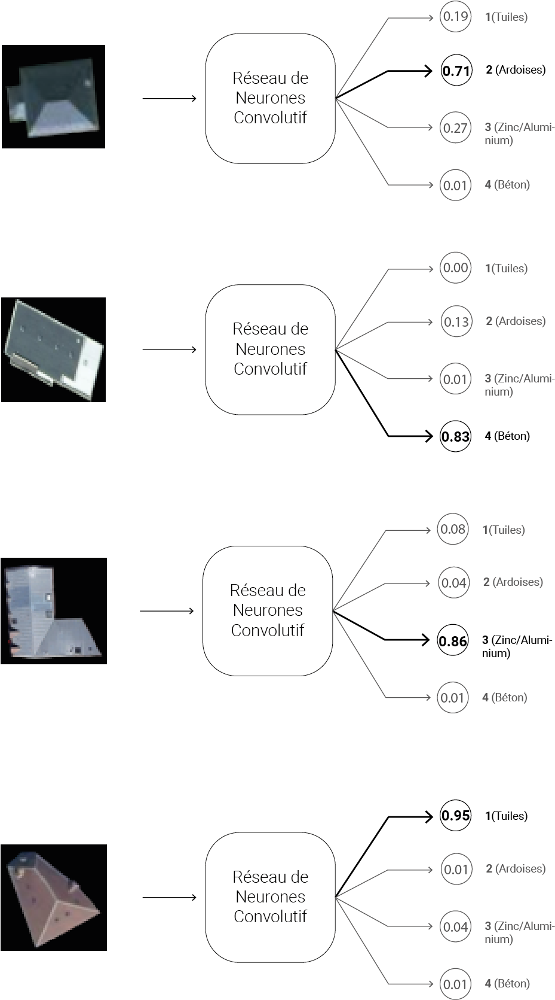
```

\newpage

À travers ce dernier chapitre, le langage de programmation Python a démontré sa capacité à répondre à
l'enjeu de**l'agrégation** de jeux de données provenant de **sources différentes**, de sorte à
compiler sa propre **base de données** pouvant être basée sur des **thématiques multiples**, ce qui présente
un potentiel certain pour l'architecte.
\
\
En effet, des bibliothèques comme **GeoPandas** permettent de l'accompagner à travers **les différentes étapes** d'un tel processus,
de l'**apurement** des données à leur **analyse approfondie** (telle que la matrice de corrélation),
le tout en prodiguant des fonctions **simples à manipuler** et à la syntaxe **clarifiée**.
\
\
Au-delà de cet aspect, Python possède également une très forte affinité avec les domaines de l'**IA** et du **Machine Learning**, 
prodiguant là aussi des outils comme **AutoKeras** destinés à **simplifier la création de modèles de prédiction** 
en gérant lui-même les paramètres internes, permettant ainsi même aux plus novices **de s'approprier ce domaine par la pratique**.
\
\
Au regard de ces outils pouvant d'ores et déjà être appropriés par les architectes,
les **données disponibles actuellement** sont désormais le "réactif limitant" de l'exploitation de l'Open Data,
ouvrant des opportunités qu'il convient d'explorer dans un avenir où les jeux de données sont amenés à
s'étoffer et s'enrichir.

```{r echo=FALSE}
l = "Prospective d'agrégations possibles"
s = "Réalisation personnelle"
udfig(l=l,s=s)
```
```{r matrice_prospective, echo=FALSE, fig.align = 'center', out.height = "90%",fig.show='hold'}
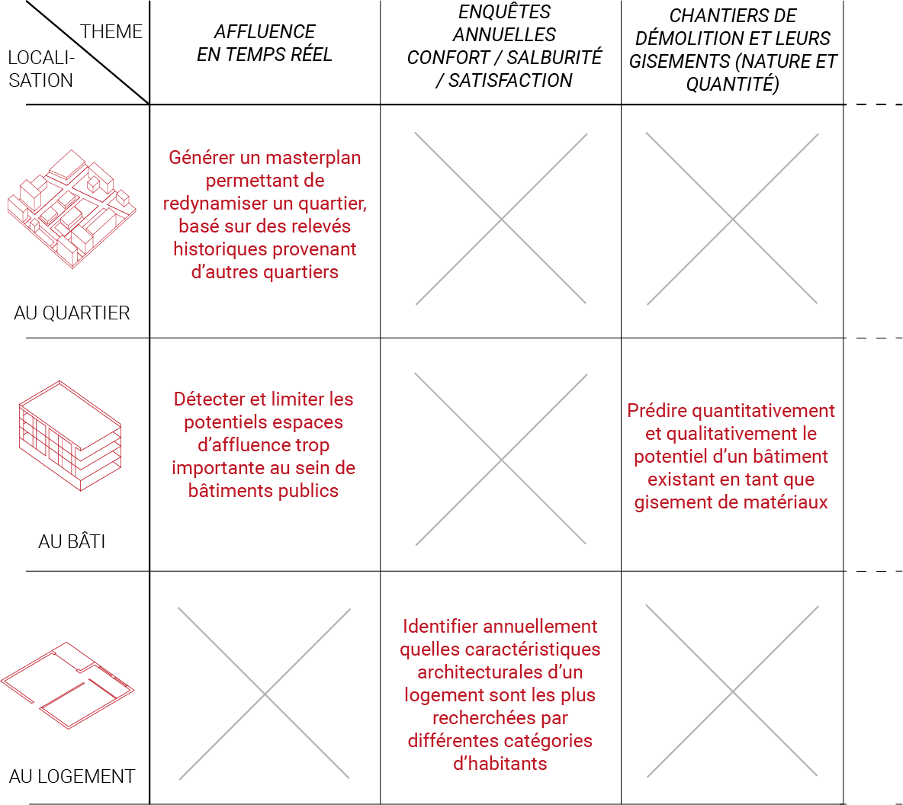
```

\newpage

# CONCLUSION {-}

Grâce à l’approche pratique proposée au sein de ce mémoire, nous avons pu démontrer que le langage de programmation Python constitue un outil souple et performant, permettant d’accompagner l’architecte tout au long de son exploitation des données issues de l’Open Data. 
\
\
En effet, permettant en premier lieu de rendre compréhensibles et manipulables aux plus novices les structures de données couramment rencontrées, et en particulier les données géoréférencées, ce langage est doté de bibliothèques constituant des outils de production de documents synthétiques tout à fait capables de représenter les données extraites dans des formats de fichiers courants pour l’architecte, élément primordial au sein de son "workflow". Ainsi, au-delà des graphiques statistiques, Python permet la génération de cartographies interactives, mais surtout des dessins techniques hiérarchisés et même des modèles 3D de manière automatique et personnalisée, représentant un gain de temps considérable.
\
\
Enfin, l’architecte devient capable grâce à Python de mener ses propres travaux d'agrégation et d'exploitation approfondie de jeux de données multi thèmes, afin de les mettre à profit dans son activité de conception, grâce à une capacité d’identification de corrélations entre ces différentes données agrégées, ou encore celle de pouvoir  entrainer ses propres modèles de prédiction ou de classification, grâce à une approche pratique simplifiée du Machine Learning.
\
\
De plus, épaulé par divers modules permettant tous ces usages de manière simplifiée tout au long du processus d’exploitation des données ouvertes, le Python acquiert un véritable caractère universel, autant dans le sens où il est capable de se suffire à lui-même que pour qualifier sa compatibilité extraordinaire avec d’autres outils et services (comme Rhinocéros).
\
\
Au-delà du cadre de l’exploitation des données issues de l’Open Data, ce langage représente un véritable pivot afin d’accompagner les agences vers de nouveaux outils plus intelligents.
\
\
Premièrement, l’expérience acquise durant la manipulation des jeux de données ouverts (en particulier sur les notions des structures de données) sera extrêmement précieuse lorsqu’il s’agira d’exploiter des jeux de données plus directement liés à la pratique architecturale en elle-même, comme depuis un parc de « Smart Buildings » qu’il faudra surveiller et analyser par exemple.
\
\
Au-delà de cet aspect, des solutions logicielles émergentes telles que « Générative Design in Revit » publiée par Autodesk [@gdrevit] et désormais intégrée à Revit 2021 proposent déjà à l’architecte de travailler aux côtés d’algorithmes évolutifs et prédictifs, que ce soit de manière simplifiée par interface graphique ou bien personnalisable grâce à des langages de programmation visuelle comme Dynamo. La collaboration entre agences d’architecture et solutions intégrant de l’Intelligence artificielle commence également à se développer, tel que l'illustre l'exemple de l’agence *Valode&Pistre* et son partenariat avec « SpaceMaker AI» [@valodepistre], société norvégienne spécialisée dans la conception urbaine générative.
\
\
Ainsi, de nouvelles solutions sont développées chaque année, mais il existera toujours un besoin de **programmer des outils** spécifiques à différents types de projet
et de problématiques au sein de ces derniers, telles que l'insertion urbaine, la conception de l'enveloppe ou encore la question des usages. 

\
\
Toutes ces opportunités nouvelles requièrent une certaine familiarité avec le fonctionnement algorithmique en général, et surtout une assimilation de leur manière de fonctionner afin de les intégrer efficacement à son « workflow »
.\
\
Dès lors, par son statut de langage de programmation lui conférant un caractère universel quant aux notions de base informatiques et surtout algorithmiques (même avec une syntaxe simplifiée), le Python se présente comme un atout « futur proof » face à ces nouvelles interactions architecte-machine. De plus, l’adoption massive du Python par les architectes permettrait d’amorcer  une lutte contre la crainte de la montée en puissance de l’Intelligence artificielle au sein des métiers du bâtiment, par une atténuation considérable de l’effet « Boite noire » qu’elle suscite. Ceci faciliterait donc grandement la transition du corps architectural dans la numérisation du domaine du bâtiment.
\
\
Au-delà de cette appropriation, une certaine motivation de créer des outils logiciels par les architectes pour les architectes intégrant ces nouvelles compétences pourrait émerger, permettant alors de réaffirmer la place du métier d’architecte au sein d’un écosystème de plus en plus techno centré.

\newpage

# BIBLIOGRAPHIE {-}


<div id="refs"></div>

\newpage

# ICONOGRAPHIE {-}

\renewcommand{\listfigurename}{}

\listoffigures

\newpage

# ANNEXE : UN MÉMOIRE RÉDIGÉ EN R MARKDOWN {-}

\linespread{2.0}

Ce mémoire a été rédigé dans son intégralité en utilisant le langage **R markdown**, sous la forme d'un seul script.
\
\
Ce langage est basé en grande partie sur la syntaxe **Markdown** [@mdsynt], dont le but est de prodiguer un moyen
de rédiger des documents textuels de manière **simplifiée** et **souple**, exportable dans une multitude de supports, du format HTML (pour un affichage web) au format PDF 
paginé pour impression.


```{r echo=FALSE}
l = "Un langage à la fois complet et souple à la syntaxe composée exclusivement de caractères spéciaux"
s = "https://markdown-it.github.io/"
udfig(l=l,s=s)
```
```{r markdown, echo=FALSE, fig.align = 'center', out.width = "100%",fig.show='hold'}
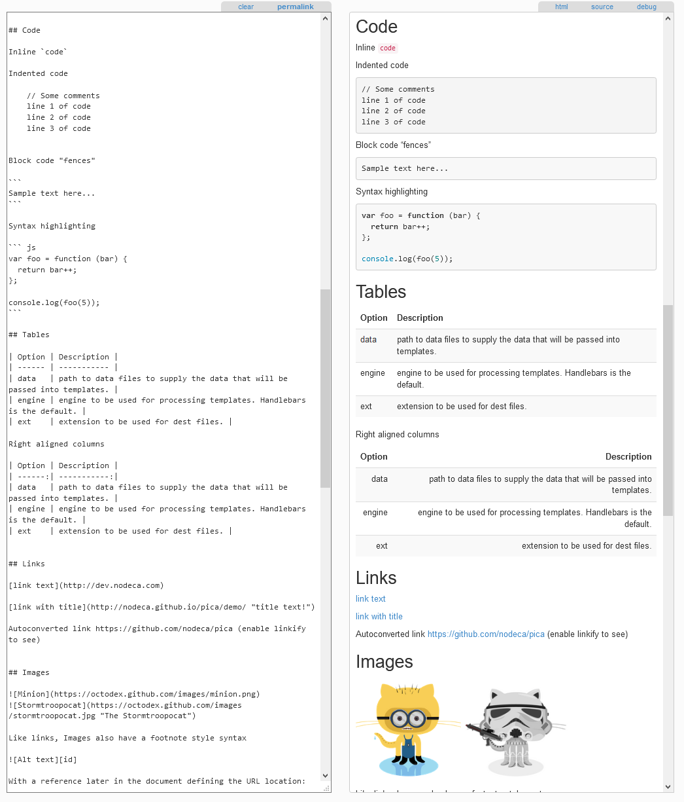
```

Dans le cadre du mémoire, je me suis plutôt orienté sur son dérivé augmenté par le langage de programmation **R** (d'où le nom de *R markdown*) pour les raisons suivantes :

* Là où le *Markdown* permet uniquement d'afficher du code, il est possible ici **d'éxecuter
du code directement au sein du document, permettant de s'assurer de son caractère fonctionnel.** Le tout reste hautement configurable, permettant l'affichage des données en sortie (output),
ainsi que de gérer la mise en forme graphique.

* Grâce à un autre logiciel nommé **LaTeX**, il est possible d'y intégrer facilement des **références bibliographiques**, via un fichier .bib contenant les différents ouvrages
et leurs informations, en pouvant spécifier la norme des références. La gestion des **images et figurés** est également facilitée, avec une numérotation ainsi qu'une iconographie générée automatiquement tout
en restant paramétrable.

* L'insertion de caractères relatifs **aux notations mathématiques** est également facilitée, pouvant s'avérer extrêmement utile.

* Il sera possible **avec peu de changements** à apporter au script d'exporter facilement mon mémoire vers d'autres formats (HTML/DOCX/etc.) À l'avenir.


Cependant, bien que cette solution se soit révélée d'une praticité redoutable dans le cadre de mon mémoire, il me paraît important de souligner les quelques difficultés
rencontrées.

* Là où le *Markdown* ne requiert le plus souvent aucune installation tierce pour fonctionner (étant la plupart du temps intégré directement aux éditeurs de texte),
la liste de programmes à installer est ici assez conséquente. En plus du langage **R**, ce sont au total **trois solutions logicielles** qui sont réclamées afin de pouvoir générer
un fichier PDF (avec LaTeX pesant notamment entre 7 et 8Go).

```{r echo=FALSE}
l = "Outils et formats intermédiaires utilisés pour générer un fichier PDF"
s = "https://markdown-it.github.io/"
udfig(l=l,s=s)
```
```{r pandoc, echo=FALSE, fig.align = 'center', out.width = "100%",fig.show='hold'}
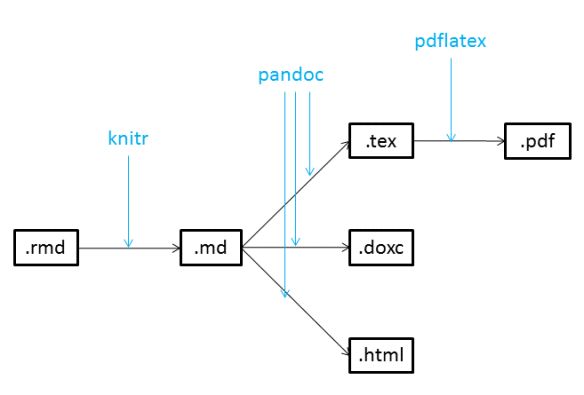
```

* L'utilisation de **LaTeX**, **Pandocs** et **Knitr** en plus du *R markdown* permet une large palette de paramétrage,
que l'on paye parfois au prix **d'incompatibilités entre certaines options présentes sur plusieurs de ces programmes à la fois**.

* Enfin, le point le plus frustrant a été **le manque de documentation officielle sur certaines fonctionnalités**. Bien que l'on puisse y remédier grâce 
aux forums de discussion entre autres, cela représente l'antithèse de la simplicité du *Markdown*, dont la documentation de qualité foisonne sur internet.

Malgré ces défauts, cela reste un moyen efficace de rédiger un document de recherche tel qu'un mémoire, et encore davantage pour des documents plus conséquents comme une thèse.
Cependant, je souhaiterais explorer d'autres outils similaires moins répandus, mais plus minimalistes dans leur approche comme le **Groff**, afin de déterminer quelle solution
est à la fois complète, simple et souple.