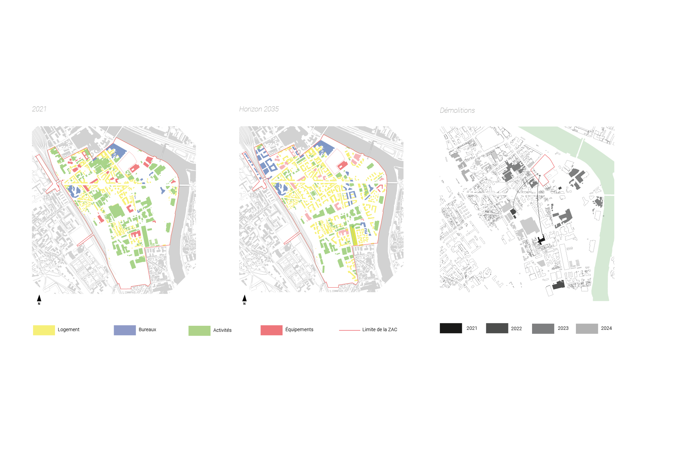

```{r echo=FALSE}
l = "Import de données au format CSV dans Python via Pandas"
s = "Réalisation personnelle"
udfig(l=l,s=s)
```
```{r io_csv, echo=FALSE, fig.align = 'center', out.width = "90%"}
include_graphics("__imgs/io_csv.png")
```

Une fois téléchargé, le fichier .CSV peut être importé dans un script Python, grâce à la bibliothèque **Pandas**, spécialisée dans la manipulation de
bases de données formatées sous forme de tableur. Afin de ne séléctionner que les variables les plus pertinentes, le paramètre *usecols* (signifiant *"useful columns"*, soit "colonnes utiles") sera utilisé
afin d'indiquer au code de ne garder que les colonnes **geom**,**H_ET_MAX**,**L_B_U** et **M2_PL_TOT**.
\
Enfin, la fonction  **print()** nous permettra d'afficher seulement les 5 premiers enregistrements du jeu de données.
\

```{python a1}
# Import de la bibliothèque pandas (appelé ici avec l'abréviation "pd")
import pandas as pd
# Lecture du fichier CSV avec les colonnes choisies
data = pd.read_csv("DONNEES/volumesbatisparis.csv",sep=";",usecols=["geom","H_ET_MAX","L_B_U","M2_PL_TOT"])
# Affichage des 5 premiers enregistrements
print(data.head(5))
```
\

Dès lors, comme montré lors de la première lecture, la colonne *geom* comporte plusieurs valeurs par case (à savoir le type de géométrie et ses coordonnées).

Or, cela pose problème dans un format de type tableur, ne pouvant afficher qu'un type de valeur par case (soit du texte, soit des nombres).
Afin de conserver le maximum d'informations, ce tableau inclue les informations géométriques en **texte brut seulement** ("chaine de caractères", ou "str" en anglais),
comme le prouve la commande ci-dessous.

```{python a2}
# Affichage du type de données dans la colonne "geom"
print(type(data["geom"][0]))
```

Ayant perdu le formatage de ces données, il est impossible d'en extraire des données en l'état. 
Heureusement, le langage Python possèdant une riche collection de bibliothèques internes,
une bonne connaissance de ces dernières permet dans la majorité des cas de palier à ce genre de problèmes.
Ainsi, grâce au code ci-dessous, les deux valeurs peuvent être extraites individuellement.
\

```{python a3}
import ast
# Permet à Python de reconnaitre une notation à partir de texte
geom0 = ast.literal_eval(data["geom"][0])
# Affichage des deux informations de "geom" individuellement
print(geom0["type"])
print(geom0["coordinates"])
```

\
Bien que cela fonctionne, ce n'est pas une bonne pratique à adopter en règle général. En effet, il peut arriver qu'une des valeurs 
inscrites dans une valeur *"mère"* se décompose elle-même en un ensemble de valeurs. Il faudrait alors répéter la commande précédente autant de fois que
nécessaire, tout en étant sûr à 100% que chaque enregistrement soit construit de manière identique sur l'ensemble du jeu de données.
\
\

### La notation objet : une structure universelle et souple

Ce dernier peut se décomposer en deux éléments primaires : le **dictionnaire**, un ensemble formé de couples **attribut : valeur** (aussi appelés *"objets"*), et la **liste**, une collection d'objets [@json].
\

```{r echo=FALSE}

```

```{python}
# exemple de structure d'un script json
js = [ # début de la liste
        { # dictionnaire 1
          "attribut" : "valeur", # couple attribut : valeur
          "attribut2" : [0,1,2,3,4] # une liste peut être une valeur
        },
        { # dictionnaire 2
          "attribut" : { "attribut3" : "valeur3" }, # un dictionnaire contenant lui même des objets peut être une valeur
          "attribut2" : 99
        }
      ] # fin de la liste
```


Ainsi, ces deux constituantes suffisent à représenter des hiérarchies pouvant être complexes, tout en restant facile à lire et écrire pour les humains.


```{r echo=FALSE}
l = "Import de données au format JSON dans Python"
s = "Réalisation personnelle"
udfig(l=l,s=s)
```
```{r io_json, echo=FALSE, fig.align = 'center', out.width = "90%"}
include_graphics("__imgs/io_json.png")
```
\
Or, la liste et le dictionnaire sont tous deux très courants au sein des langages de programmation modernes.
Ainsi, l'import au sein de Python est extrêmement limpide. 
La syntaxe afin d'accéder à une valeur donnée s'effectue simplement en saisissant l'**index de l'objet souhaité** pour les listes et le **nom des attributs** en partant de la base de l'arborescence (de gauche à droite) pour les dictionnaires. 

```{python}
# 1er objet de la liste (dictionnaire 1), puis "attribut2"
print(js[0]["attribut2"])
```

```{python}
# 2e objet de la liste (dictionnaire 1), puis "attribut2" (dictionnaire 3), puis "attribut3"
print(js[1]["attribut"]["attribut3"])
```

La méthodologie est identique lors de l'import d'un fichier JSON externe, qui sera en l'occurence le même jeu de données téléchargé depuis le site
Open Data Paris, mais au format .JSON. 

```{python}
import json
data = json.load(open("DONNEES/volumesbatisparis.json","r"))
# premier objet de la liste de volumes
print(data[1])
```

Cette lecture d'un des volumes du jeu de données au format JSON permet de repérer ses différents niveaux hiérarchiques,
tout en observant les information supplémentaires dont on dispose.
\
Tout d'abord, les variables du jeu de données d'origine sont ici présentes sous l'attribut **fields**.
En son sein, la variable **geom** contient un dictionnaire avec ses deux valeurs (à savoir son type et ses coordonnées).
Nous pouvons également noter que les coordonnées sont constituées d'une **liste contenant des listes à deux valeurs**, représentant tout simplement une collection
de points (définis par x et y). Cependant, elle est elle même contenue dans une liste englobante superflue, que nous allons supprimer par la suite.
\
\
Ainsi, il est possible d'extraire les variables initialement souhaitées pour chacun des volumes avec une **boucle**, qui itèrera
à travers la liste des volumes. Les résultats obtenus seront ajoutés dans un nouveau dictionnaire (avec des attributs nommés plus explicitement), lui même ajouté à une liste vide.
\
```{python error=TRUE}
liste = [] # liste vide
for volume in data:
  liste.append({
    # Le [0] à la fin permet de supprimer la liste englobante superflue
    "coords" : volume["fields"]["geom"]["coordinates"][0],
    "surface" : volume["fields"]["m2_pl_tot"],
    "hauteur" : volume["fields"]["h_et_max"],
    "hauteur_paf" : volume["fields"]["l_b_u"]
  })
```
\

Cependant, nous obtenons l'erreur *KeyError : "l_b_u"*, signifiant que l'attribut **l_b_u** n'est pas défini pour certains objets.
En effet, la notation objet permet ici de ne défnir cet attribut que lorsque le volume **est en porte à faux**, qu'il serait inutile
d'attribuer aux autres. Cette **hétérogénéité** est donc à prendre en compte lors du traitement. 
\
\
D'un point de vue plus général, cette dernière est très courante dans les jeux de données ouvertes.
Au-delà d'être causée quand **certains enregistrements** possèdent **des attributs qui leurs sont propres** sans toutefois justifier la création
d'un jeu de données supplémentaire (comme les volumes en porte à faux ici, difficilement dissiociables des autres), 
elle peut être tout simplement provoquée par **certaines valeurs manquantes** dans différents enregistrements (dans le cas d'une enquête 
aussi complexe et étendue que celle des hauteurs des bâtiments de Paris, cela est compréhensible).
Enfin, comme c'est le cas ici, cette hétérogénéité se révèle pendant l'extraction, car pas toujours mentionnée dans les métadonnées.
\
\
En conséquences, les fonctions de gestion d'erreur **try** et **except** seront utilisées afin de détécter 
l'absence de l'attribut **l_b_u**. Lorsque **try**, essayant d'accéder à l'attribut **l_b_u** se retrouve face
à l'erreur recontrée précédemment, **except** se chargera de la détécter et d'exécuter un autre morceau de code à la place.
\

```{python}
liste = [] # liste vide
for volume in data:
  try:
    #
    liste.append({
      "coords" : volume["fields"]["geom"]["coordinates"][0],
      "surface" : volume["fields"]["m2_pl_tot"],
      "hauteur" : volume["fields"]["h_et_max"],
      "hauteur_paf" : volume["fields"]["l_b_u"]
    })
  except KeyError:
    liste.append({
      "coords" : volume["fields"]["geom"]["coordinates"][0],
      "surface" : volume["fields"]["m2_pl_tot"],
      "hauteur" : volume["fields"]["h_et_max"]
    })

print(liste[1])
print(liste[7])
```


A l'instar du jeu de données étudié au cours des chapitres précédents dont un échantillon spécifique a été prélevé, 
la **massivité d'un jeu de données** est une caractéristique courante en Open Data.
Dès lors, au vu de leur grande taille, certains jeux peuvent être considérés comme suffisamment **représentatifs** vis à vis de ce qu'ils recensent.
Autrement dit, c'est une véritable source de connaissances numérique.
\
\
Or, le domaine de **l'Intelligence Artificielle**, et tout particulièrement le **Machine Learning** se reposent sur des données disponibles 
en grande quantité pour pouvoir entraîner des algorithmes. En effet, la précision d'un algorithme étant lié à sa capacité à **généraliser** les connaissances 
qu'on lui fournit lors d'une session d'entraînement, il convient de disposer de données suffisamment **variées et exhaustives**, tout en étant **en grand nombre**
afin de permettre un apprentissage optimal.
\
\
Il s'avère également que le langage de programmation Python figure parmi les langages les mieux équipés pour le Machine Learning, disposant de bibliothèques 
comme **Scikit-Learn**[@sklearn] proposant une approche simplifiée à travers des algorithmes primaires, 
jusqu'aux plateformes majeures du secteur comme **TensorFlow**[@tensorflow] ou **PyTorch**[@pytorch] majoritairement basées sur ce langage proposant des 
fonctionnalités plus approfondies.
\
\
**Un enjeu de taille apparaît alors, celui d'être en capacité d'entraîner un modèle de prédiction exploitable dans la pratique professionnelle de l'architecte
basé sur des donnéees accessibles en Open Data**
\
\
Ce chapitre sera justement centré sur un algorithme que j'ai développé au cours du Semestre 9 dans le cadre de mon Projet de Fin d'Études,
**capable d'approcher quantitativement des gisements de matériaux sur l'existant**, en particulier sur la phase initiale concernant 
**l'état des lieux des données** ainsi que leur **exploitation avec le langage Python** .

## Problématique du modèle de prédiction

Le développement de cet outil ayant émergé selon un besoin précis dans le cadre d'une intervention architecturale, 
cette première section aura pour but de présenter le cadre de la démarche ainsi que les données mobilisées.

### Du contexte à la démarche

La volonté de mettre en place un algorithme prend ses racines sur une problématique contextuelle liée au site 
d'intervention ciblé.
\
Le site en question est celui des anciens entrepôts du BHV (Bazar de l'Hotel de Ville) à Ivry sur Seine.
Cet immense terrain laissé à l'état de friche depuis 2013 est situé au sein de la **ZAC Ivry-Confluences**, ancien
territoire fortement industrialisé **en renconversion** depuis une dizaine d'années.
\
\
```{r echo=FALSE}
l = "Photographie aérienne de la ZAC Ivry Confluences, contexte du site choisi"
s = "Google Earth"
udfig(l=l,s=s)
```
```{r zac_photo, echo=FALSE, fig.align = 'center', out.width = "90%",fig.show='hold'}

```
\
\
Bien que cette reconversion aie pour volonté de conserver un maximum de bâti industriel existant, elle sera malgré tout
à l'origine de nombreuses **démolitions**, notamment à cause de la vétusté d'une partie de ce patrimoine et le nouveau tissu urbain
induisant une multitude de nouvelles voies de circulation découpant les grands îlots existants.
\
\
```{r echo=FALSE}
l = "Transformation de la ZAC et temporalitée des démolitions"
s = "Réalisation personnelle"
udfig(l=l,s=s)
```
```{r zac_schema, echo=FALSE, fig.align = 'center', out.width = "90%",fig.show='hold'}

```
\
\
Dès lors, il existe un véritable enjeu autour de la **valorisation** de ces gisements de métariaux de réemploi issus de la démolition,
dont j'ai alors immédiatement envisagé de me saisir comme ressources de construction.
Inévitablement, il est nécessaire de les approcher à la fois de manière **qualitative et quantitative** afin de pouvoir les exploiter
pleinement au sein d'un projet.